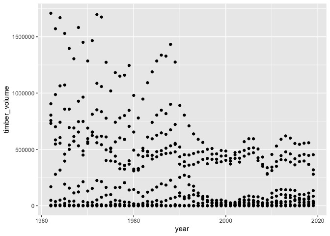
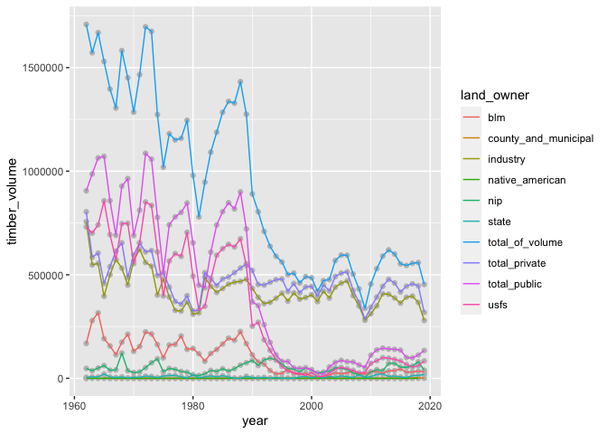
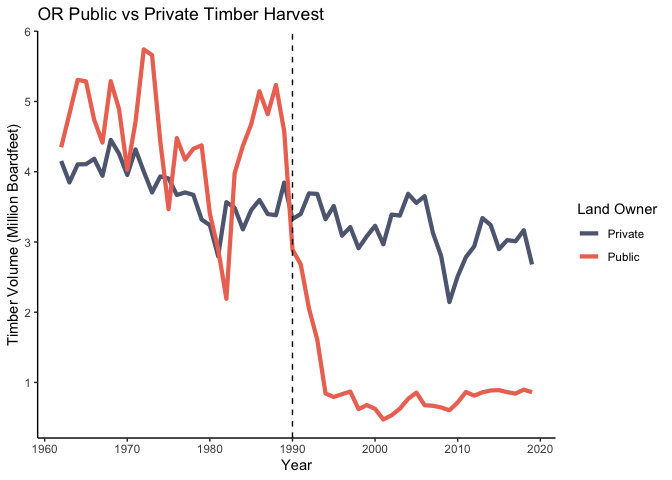

# Introduction 

Today we are going to talk about data wrangling in the [tidyverse](https://www.tidyverse.org/), which is a collection of packages that share the same underlying "philosophy" (Data structures/grammar) used for pretty much any data science task you can think of. 

*Note: The `tidyverse` package is really a collection of a bunch of other packages. When you install/load `tidyverse` it installs and loads all of those packages, but you could just as well install/load them individually.*

First, we need some data. Let's go download some and load them into `R`. This will be a much more common data workflow than using data from a package as we did last week. Click [this link](https://data.oregon.gov/api/views/c3sg-dt24/rows.csv?accessType=DOWNLOAD) to download the timber harvest data from Oregon between 1962 and 2019. Documentation for these data is [here](https://data.oregon.gov/Natural-Resources/Timber-Harvest-Data-1962-2019/c3sg-dt24?category=Natural-Resources&view_name=Timber-Harvest-Data-1962-2019).  

Reading CSV's is as simple as using the `read_csv` function (or Base R's `read.csv`), but you have to tell `R` exactly where that file is on your computer. That is where things can get a little bit tricky, because everyone has different folder names and file structures. For example, the following code will not work on your computer, because it has the file path from my computer.     


```r
# Loading packages
library(pacman)
p_load(tidyverse)

# Reading the CSV
timber_df = read_csv(
  "/Users/esaulnier/Dropbox (University of Oregon)/My Mac (MacBook-Pro.local)/Downloads/Timber_Harvest_Data_1962-2019.csv"
)
```

There are lots of hack-y ways to deal with this that involve manually typing in file paths, but R-Studio projects and the [here](https://here.r-lib.org/) package are the **best** way to deal with this problem. Lets take a quick tangent to discuss these before getting into the `tidyverse`.  


# Projects and Directories

Projects make it easy to manage data and code files that are being used together. For example -- you could have a separate project for each of the problem sets in this class, or just one project for all of the material in this class. If you have not created a project for this class, lets make one now.

To create a new project, click `File > New Project` or  in R-Studio. 

This will launch a pop-up that asks you whether you want to use a "New Directory", "Existing Directory", or "Version Control". If the folder ("Directory") that you want to create a project for already exists, click "Existing Directory" and then find the folder you want to use. Otherwise create a new directory, call it something like `ec421-w22`.  

Once you have created and opened the project, R-Studio tells you what project you have open in the upper right hand corner of the screen. 

*Note: You can click the triangle next to the project name to easily switch between projects or create new ones.*  

## Working Directory  

So why go to all this trouble? There are lots of benefits, but the main one is that when you have a project open, R-Studio automatically sets the project's directory as the **working directory**. What is a working directory? It's a file path on your computer that is used as the default when reading files into `R`. 


```r
# Checking the working directory  
getwd()
```

```
## [1] "/Users/esaulnier/Dropbox (University of Oregon)/My Mac (MacBook-Pro.local)/Documents/ge-assignments/EC421-Lab-W22/02-tidyverse"
```

```r
# Showing the files available in this directory
list.files()
```

```
## [1] "figures"                           "lab-02-tidyverse_files"           
## [3] "lab-02-tidyverse.html"             "lab-02-tidyverse.md"              
## [5] "lab-02-tidyverse.Rmd"              "Timber_Harvest_Data_1962-2019.csv"
```

*Note: R-Markdown files automatically set the working directory to the one that the file is saved in.* 

You can see that my working directory is the folder I have created for this lab, `EC-421-Lab-W22/02-tidyverse`, and all the files related to this lab are in that directory, including the `Timber_Harvest_Data_1962-2019.csv` file we want to load! Copy the csv file in your project directory, and now you can read it using the following code. 


```r
# Reading csv
timber_df = read_csv("Timber_Harvest_Data_1962-2019.csv")
```

But wait, this still won't work if I try to run it outside of the R-Markdown file I am writing these notes in. That's where the `here` package swoops in to save the day.

# Here
The [here](https://here.r-lib.org/) package is extraordinarily useful and quite simple.


All you have to do is use the `here()` function to tell `R` where to look relative to the project's root directory. All the `here()` function does is spit out the entire file path for the file you specify, but without you having to manually type it out. 


```r
# Loading package
p_load(here, janitor)

# What does here() do? 
here("02-tidyverse/Timber_Harvest_Data_1962-2019.csv")
```

```
## [1] "/Users/esaulnier/Dropbox (University of Oregon)/My Mac (MacBook-Pro.local)/Documents/ge-assignments/EC421-Lab-W22/02-tidyverse/Timber_Harvest_Data_1962-2019.csv"
```

```r
# Reading the csv!
timber_df_raw = read_csv(here("02-tidyverse/Timber_Harvest_Data_1962-2019.csv")) |>
  clean_names() # Removes spaces and capital letters from column names
```

I don't like having spaces or capital letters in my column names, which the `janitor::clean_names()` function takes care of easily. Now that we've got our data loaded, lets see what is in there using some tools from last week. 

*Note: You can reference which package a function comes from using `::`, e.g. `package::function()`.*


```r
# Exploring the data a bit
head(timber_df_raw)
```

```
## # A tibble: 6 × 12
##    year county       blm   usfs state county_and_municipal industry   nip
##   <dbl> <chr>      <dbl>  <dbl> <dbl>                <dbl>    <dbl> <dbl>
## 1  1962 BAKER       5858  58900     0                    0        0  6540
## 2  1962 BENTON     33001   6100  4376                    0    22830 21793
## 3  1962 CLACKAMAS  38314 208600   175                    0   108556 11393
## 4  1962 CLATSOP        0      0 24340                    0   206050  6049
## 5  1962 COLUMBIA       0      0     0                    0    15486 21183
## 6  1962 COOS      128475  33700 25910                    0   307841 27053
## # … with 4 more variables: native_american <dbl>, total_of_volume <dbl>,
## #   total_private <dbl>, total_public <dbl>
```

```r
summary(timber_df_raw)
```

```
##       year         county               blm              usfs       
##  Min.   :1962   Length:2088        Min.   :     0   Min.   :     0  
##  1st Qu.:1976   Class :character   1st Qu.:     0   1st Qu.:   746  
##  Median :1990   Mode  :character   Median :   303   Median : 13271  
##  Mean   :1990                      Mean   : 17218   Mean   : 49869  
##  3rd Qu.:2005                      3rd Qu.: 10972   3rd Qu.: 56470  
##  Max.   :2019                      Max.   :552354   Max.   :857200  
##                                                     NA's   :5       
##      state        county_and_municipal    industry           nip        
##  Min.   :     0   Min.   :    0.0      Min.   :     0   Min.   :     0  
##  1st Qu.:     0   1st Qu.:    0.0      1st Qu.:  5586   1st Qu.:  1854  
##  Median :     0   Median :    0.0      Median : 30276   Median :  7380  
##  Mean   :  6179   Mean   :  929.9      Mean   : 80365   Mean   : 13136  
##  3rd Qu.:  4857   3rd Qu.:  376.0      3rd Qu.:101001   3rd Qu.: 17318  
##  Max.   :123712   Max.   :21878.0      Max.   :802104   Max.   :316492  
##                   NA's   :76                            NA's   :3       
##  native_american  total_of_volume   total_private     total_public    
##  Min.   :     0   Min.   :      0   Min.   :     0   Min.   :      0  
##  1st Qu.:     0   1st Qu.:  35358   1st Qu.: 12238   1st Qu.:   7247  
##  Median :     0   Median :  93184   Median : 46195   Median :  29078  
##  Mean   :  2285   Mean   : 169790   Mean   : 95747   Mean   :  74042  
##  3rd Qu.:     0   3rd Qu.: 192265   3rd Qu.:118043   3rd Qu.:  78847  
##  Max.   :103149   Max.   :1856429   Max.   :862399   Max.   :1086607  
##  NA's   :17
```

Looks like each row is for a county in a particular year and columns are timber harvest volumes for different categories of land owners. The data structure we loaded is called a "tibble", which is really just the `tidyverse`'s version of a fancy data frame. 

**Q: How many rows are in our data?**  


# Tidy Data 

So why is the `tidyverse` called the `tidyverse`? It is centered around the idea of ["tidy" data](https://tidyr.tidyverse.org/), which is data stored under three rules:    
  
  1. Every column is a variable  
  2. Every row is an observation  
  3. Every cell is a single value  

Generally this means that data is "long" rather than "wide". Is our `timber_df` tidy? **NO**, each row has many columns containing a value for timber harvest volume. We can create a new variable, `land_owner`, and then a single column `timber_volume` with all of the value for harvest volume in it using the `tidyr::pivot_wider` function. 


```r
# Tidying the data 
timber_df =   
  timber_df_raw |>
  pivot_longer(
    cols = 3:12, # Columns we want to pivot
    names_to = "land_owner", # column name for labels  
    values_to = "timber_volume" # column name for values
  )

# Looking at the tidy data
head(timber_df, n = 10)
```

```
## # A tibble: 10 × 4
##     year county land_owner           timber_volume
##    <dbl> <chr>  <chr>                        <dbl>
##  1  1962 BAKER  blm                           5858
##  2  1962 BAKER  usfs                         58900
##  3  1962 BAKER  state                            0
##  4  1962 BAKER  county_and_municipal             0
##  5  1962 BAKER  industry                         0
##  6  1962 BAKER  nip                           6540
##  7  1962 BAKER  native_american                  0
##  8  1962 BAKER  total_of_volume              71298
##  9  1962 BAKER  total_private                 6540
## 10  1962 BAKER  total_public                 64758
```

Now we have a much nicer structure that is easy to work with! 

**Q: How many rows are in our data now?**  


# Selecting Data  

Last week we learned that we could select columns using `df$col_name` or columns and rows with syntax like `df[i,j]`. But the `dplyr` package has some functions that are much more powerful for doing this, `select` and `filter`.  


```r
# Selecting Columns 
timber_df |> select(year, county)
```

```
## # A tibble: 20,880 × 2
##     year county
##    <dbl> <chr> 
##  1  1962 BAKER 
##  2  1962 BAKER 
##  3  1962 BAKER 
##  4  1962 BAKER 
##  5  1962 BAKER 
##  6  1962 BAKER 
##  7  1962 BAKER 
##  8  1962 BAKER 
##  9  1962 BAKER 
## 10  1962 BAKER 
## # … with 20,870 more rows
```

```r
# Filtering rows using logical expressions
timber_df |> filter(year == 2019 & land_owner == "industry")
```

```
## # A tibble: 36 × 4
##     year county     land_owner timber_volume
##    <dbl> <chr>      <chr>              <dbl>
##  1  2019 BENTON     industry           71926
##  2  2019 CLACKAMAS  industry           74338
##  3  2019 CLATSOP    industry          135899
##  4  2019 COLUMBIA   industry          116311
##  5  2019 COOS       industry          116909
##  6  2019 CURRY      industry           58282
##  7  2019 DOUGLAS    industry          547271
##  8  2019 HOOD RIVER industry            9649
##  9  2019 JACKSON    industry           54263
## 10  2019 JOSEPHINE  industry           15494
## # … with 26 more rows
```

**Q: What was the volume of timber harvested on USFS land in Lane County in 2005?**


*Note: There are [many ways](https://dplyr.tidyverse.org/reference/dplyr_tidy_select.html) to specify which columns we want to select, but often the obove syntax is the easiest.*  

# Manipulating Data 

We can sort data using `dplyr::arrange()`. Lets see which year had the highest total timber harvest on public land in Lane County. By default, `arrange` sorts numbers in ascending order, so we can tell it to sort in descending order using `desc()`.


```r
# Years with most harvest on public land 
timber_df |>
  filter(county == "LANE" & land_owner == "total_public") |>
  arrange(desc(timber_volume))
```

```
## # A tibble: 58 × 4
##     year county land_owner   timber_volume
##    <dbl> <chr>  <chr>                <dbl>
##  1  1972 LANE   total_public       1086607
##  2  1965 LANE   total_public       1071688
##  3  1964 LANE   total_public       1064266
##  4  1973 LANE   total_public       1058080
##  5  1963 LANE   total_public        987009
##  6  1969 LANE   total_public        964206
##  7  1968 LANE   total_public        927865
##  8  1962 LANE   total_public        904893
##  9  1988 LANE   total_public        900308
## 10  1966 LANE   total_public        857397
## # … with 48 more rows
```

One of the more powerful functions here is `dplyr::mutate()`, which allows us to create new columns. These new columns can be functions of existing columns (or even functions of columns you've created in the same mutate function call). Remember to assign the output to a name if you want to save the new column(s) you created.


```r
# Creating new variables 
timber_df = 
  timber_df |>
  mutate(
    injunction = year >= 1990,
    injunction_federal = injunction & land_owner %in% c("blm","usfs","total_public")
  )

# Showing the df with new columns 
timber_df |> filter(year %in% 1989:1990 & county == "BAKER")
```

```
## # A tibble: 20 × 6
##     year county land_owner           timber_volume injunction injunction_federal
##    <dbl> <chr>  <chr>                        <dbl> <lgl>      <lgl>             
##  1  1989 BAKER  blm                           3198 FALSE      FALSE             
##  2  1989 BAKER  usfs                         47525 FALSE      FALSE             
##  3  1989 BAKER  state                            0 FALSE      FALSE             
##  4  1989 BAKER  county_and_municipal             0 FALSE      FALSE             
##  5  1989 BAKER  industry                      5084 FALSE      FALSE             
##  6  1989 BAKER  nip                          14242 FALSE      FALSE             
##  7  1989 BAKER  native_american                  0 FALSE      FALSE             
##  8  1989 BAKER  total_of_volume              70049 FALSE      FALSE             
##  9  1989 BAKER  total_private                19326 FALSE      FALSE             
## 10  1989 BAKER  total_public                 50723 FALSE      FALSE             
## 11  1990 BAKER  blm                           5738 TRUE       TRUE              
## 12  1990 BAKER  usfs                         49229 TRUE       TRUE              
## 13  1990 BAKER  state                            0 TRUE       FALSE             
## 14  1990 BAKER  county_and_municipal             0 TRUE       FALSE             
## 15  1990 BAKER  industry                      9423 TRUE       FALSE             
## 16  1990 BAKER  nip                          22193 TRUE       FALSE             
## 17  1990 BAKER  native_american                  0 TRUE       FALSE             
## 18  1990 BAKER  total_of_volume              86583 TRUE       FALSE             
## 19  1990 BAKER  total_private                31616 TRUE       FALSE             
## 20  1990 BAKER  total_public                 54967 TRUE       TRUE
```

Here I created a logical column for years after 1990, when there was an injunction placed on new logging on federal land. The [Timber Wars Podcast](https://www.opb.org/show/timberwars/) does a great job explaining why that happened. I also created a column, `injunction_federal` that tells us years and land owners that were affected by the injunction. Notice that I used the newly created `injunction` column to do this.  

*Note: The `%in%` operator is a logical operator that I forgot to discuss last week but is very useful. it checks if the object on the RHS is in the vector on the LHS (e.g. `1 %in% 1:10` returns `TRUE`, but `1 %in% 2:10` returns `FALSE`)*

# Summarizing Data

We can perform aggregations easily using the `dplyr::summarize()` function. For example, we can calculate a bunch of different statistics for harvest on BLM land in 2019.


```r
# Harvest on BLM land in 2019
timber_df |> 
  filter(year == 2019 & land_owner == "blm") |>
  summarize(
    tot_harvest = sum(timber_volume),
    avg_harvest = mean(timber_volume),
    min_harvest = min(timber_volume),
    max_harvest = max(timber_volume),
    num_rows = n() # n() is a useful helper function that tells you the number of rows
  )
```

```
## # A tibble: 1 × 5
##   tot_harvest avg_harvest min_harvest max_harvest num_rows
##         <dbl>       <dbl>       <dbl>       <dbl>    <int>
## 1      143372       3983.           0       31656       36
```

These aggregations can also be done by group using the `dplyr::group_by()` function. For example, we can do the same calculations as above, but for all years rather than just 2019. Now instead of doing aggregations across the entire dataset, the aggregations are done at the group level, with the result being the same number of rows as there are groups in the data.  


```r
# Harvest on BLM land
timber_df |> 
  filter(land_owner == "blm") |>
  group_by(year) |>
  summarize(
    tot_harvest = sum(timber_volume),
    avg_harvest = mean(timber_volume),
    min_harvest = min(timber_volume),
    max_harvest = max(timber_volume),
    num_rows = n()
  ) |>
  arrange(desc(year))
```

```
## # A tibble: 58 × 6
##     year tot_harvest avg_harvest min_harvest max_harvest num_rows
##    <dbl>       <dbl>       <dbl>       <dbl>       <dbl>    <int>
##  1  2019      143372       3983.           0       31656       36
##  2  2018      158126       4392.           0       34574       36
##  3  2017      160390       4455.           0       35693       36
##  4  2016      182462       5068.           0       40424       36
##  5  2015      193275       5369.           0       45504       36
##  6  2014      208826       5801.           0       45162       36
##  7  2013      165116       4587.           0       37232       36
##  8  2012      148216       4117.           0       42048       36
##  9  2011      164954       4582.           0       48315       36
## 10  2010      132857       3690.           0       39897       36
## # … with 48 more rows
```


**Q: What was the total timber harvest for the whole state of Oregon on Non-Industrial Private ("nip") land before and after 2000?** *Hint: Create a new variable that is an indicator for pre/post 2000, and then group by that variable*.

Now that we know how to manipulate data, lets get on to the fun stuff, visualization!  

# Plotting data

[`ggplot2`](https://ggplot2.tidyverse.org/) is another package in the `tidyverse` that implements the "grammar of graphics" to create a very elegant data visualization tool. If you want to read more about visualization in `ggplot2`, check out the [Data Visualization](https://r4ds.had.co.nz/data-visualisation.html) chapter of [R for Data Science](https://r4ds.had.co.nz). There are three basic inputs you need to create a plot using the `ggplot` function: Data, an aesthetic mapping, and layers.  

Aesthetics are some visual property of your plot: The most common ones are going to be x axis, y axis, size, color, fill, and shape. We have some experience with these from plotting in Base R last week. You specify what you want the aesthetics to be using `aes()`.  


```r
# Harvest in Lane County for each land owner by year
timber_df |> 
  filter(county == "LANE") |>
  ggplot(aes(x = year, y = timber_volume)) + # Aesthetic mapping
    geom_point() # Adds a point layer
```

<!-- -->

These plots are built in layers, meaning that once you specify your base plot using `ggplot()` you can add any number of layers on top of it using `+`. These layers are different types of visualizations: points, lines, histograms, bars, etc. The aesthetics are passed down to each layer by default, but you can also specify aesthetics within a layer. 

The above plot is confusing because each point is a different land owner, and this is time series data, so a line connecting annual observations is more appropriate. Lets create colors for each land owner and connect the points using `geom_line()`


```r
# Harvest on USFS land by year
timber_df |> 
  filter(county == "LANE") |>
  ggplot(aes(x = year, y = timber_volume)) +
    geom_point(color = "gray")+ 
    geom_line(aes(color = land_owner)) # Adds a point layer with color
```

<!-- -->

If you want to change the look of one of the layers for the entire graph, as I did with the point color above, then specify it outside of the `aes()` function. 

**Q: What would happen if I wrote `geom_point(aes(color = land_owner))` instead?**  

Additional layers can be added to change the color scales and visual attributes of the plot. Let's focus just on the total private and public land, but summarize across the entire state. 


```r
# Plot of total private and public harvest by year
timber_df |>
  filter(land_owner %in% c("total_private","total_public")) |>
  group_by(year, land_owner) |>
  summarize(tot_harvest = sum(timber_volume)) |>
  ggplot(aes(x = year, y = tot_harvest/1e6, color = land_owner)) +
    geom_line(size = 1.5) + 
    geom_vline(xintercept = 1990, linetype = "dashed") +
    labs(
      title = "OR Public vs Private Timber Harvest",
      x = "Year",
      y = "Timber Volume (Million Boardfeet)"
    ) +
    scale_color_manual(
      name = "Land Owner", # Name of the color legend
      values = c("#5f6880","#ec7662"), # Hex codes for colors we want
      labels = c("Private", "Public") # Names for color labels
    ) +
    scale_x_continuous(
      breaks = seq(1960,2020, by = 10)
    ) +
    theme_classic()
```

<!-- -->

There is a lot going on in this plot! Let's break it down step by step:  

  - First I create the data I want to plot using the `dplyr` functions we learned earlier  
  - Then I make the base plot with `ggplot()`, specifying the aesthetics `year` on x-axis, `tot_harvest` on the y-axis (scaled down by 1 million), and `land_owner` as the color  
  - Then I add a `geom_line()` to draw the lines for the data and increased the thickness of the line with the `size` argument   
  - I add a vertical dashed line in 1990 using `geom_vline()` to signify the injunction  
  - I add labels for title, x, and y with `labs()` 
  - I change the color values and labels using `scale_color_manual()`. I chose two specific colors I wanted, but there are lots of built in color palettes that you can use (e.g. `scale_color_viridis()`)  
  - I set the x-axis labels to be every 10 years from 1960 to 2020  
  - I set the theme of the plot to be `theme_classic()`: This changes things like the background, font/size of labels, axis lines, etc. All of these settings can be changed manually if you want to!  
  
We'll talk about data visualization using `ggplot2` a lot over the course of this term. You can do so much more than what I've shown you today: Density plots, maps, animations, 3D, and much more.  

**Q: Make a plot that shows me average timber harvest on public vs private land before and after 1990. Make it look good with nice labels!** *Hint: `geom_col()` makes bar charts. The fill color is altered with the `fill` aesthetic. Also if you use this (don't have to), it would be nice to set `position = "dodge"` inside `geom_col()` so that the bars are next to each other rather than on top of each other.*


