Good job on the problem set -- We plan to have those graded and back to you guys mid-week. You all have been talking about **heteroskedasticity** in lecture, and today, we are going to go through an applied example of how to deal with heteroskedasticity. We'll check scatter plots of the residuals to visually see what is going on, then test for heteroskedasticity formally using the Goldfeld-Quant and White tests, and finally, we'll talk about solutions for heteroskedasicity once we know that it is a problem.   

Today's data will be the same as Ed used as an example in class: the `Caschool` data from the package`Ecdat`.

# Loading and exploring the data  

First, let's load `pacman`. Remember to run `install.packages("pacman")` if you don't already have the package installed. Today, we'll also be using the familiar `tidyerse` and `magrittr` (package with pipes --  `%>%` or `%<>%` -- in it).


```r
# Loading packages
library(pacman)
p_load(Ecdat, tidyverse, magrittr)

# Setting theme for my plots
theme_set(hrbrthemes::theme_ipsum())
```

The `Ecdat` contains the `Caschool` dataset which features all sorts of fun heteroskedasticity we can look at.

First, lets look at the documentation for the `Caschool` data using `?`, which will pull up the help file for any function or data that is a part of a package (Use this if you don't know how a function works!).  


```r
# Loading documentation on the data
?Caschool
```

You all are already somewhat familiar with this data, but lets do a little bit of exploration using the tools we have already learned earlier in this class. 


**Q01**: How many observations are there? What time does the data cover?

Let's take a peak at the first few rows of the dataset. How do we do this?


```r
# First 6 row 
head(Caschool, n = 10)
```

```
##    distcod      county                        district grspan enrltot teachers
## 1    75119     Alameda              Sunol Glen Unified  KK-08     195    10.90
## 2    61499       Butte            Manzanita Elementary  KK-08     240    11.15
## 3    61549       Butte     Thermalito Union Elementary  KK-08    1550    82.90
## 4    61457       Butte Golden Feather Union Elementary  KK-08     243    14.00
## 5    61523       Butte        Palermo Union Elementary  KK-08    1335    71.50
## 6    62042      Fresno         Burrel Union Elementary  KK-08     137     6.40
## 7    68536 San Joaquin           Holt Union Elementary  KK-08     195    10.00
## 8    63834        Kern             Vineland Elementary  KK-08     888    42.50
## 9    62331      Fresno        Orange Center Elementary  KK-08     379    19.00
## 10   67306  Sacramento     Del Paso Heights Elementary  KK-06    2247   108.00
##    calwpct  mealpct computer testscr    compstu  expnstu      str    avginc
## 1   0.5102   2.0408       67  690.80 0.34358975 6384.911 17.88991 22.690001
## 2  15.4167  47.9167      101  661.20 0.42083332 5099.381 21.52466  9.824000
## 3  55.0323  76.3226      169  643.60 0.10903226 5501.955 18.69723  8.978000
## 4  36.4754  77.0492       85  647.70 0.34979424 7101.831 17.35714  8.978000
## 5  33.1086  78.4270      171  640.85 0.12808989 5235.988 18.67133  9.080333
## 6  12.3188  86.9565       25  605.55 0.18248175 5580.147 21.40625 10.415000
## 7  12.9032  94.6237       28  606.75 0.14358975 5253.331 19.50000  6.577000
## 8  18.8063 100.0000       66  609.00 0.07432432 4565.746 20.89412  8.174000
## 9  32.1900  93.1398       35  612.50 0.09234829 5355.548 19.94737  7.385000
## 10 78.9942  87.3164        0  612.65 0.00000000 5036.211 20.80556 11.613333
##        elpct readscr mathscr
## 1   0.000000   691.6   690.0
## 2   4.583333   660.5   661.9
## 3  30.000002   636.3   650.9
## 4   0.000000   651.9   643.5
## 5  13.857677   641.8   639.9
## 6  12.408759   605.7   605.4
## 7  68.717949   604.5   609.0
## 8  46.959461   605.5   612.5
## 9  30.079157   608.9   616.1
## 10 40.275921   611.9   613.4
```


**Q02**: What is the range of school size?  
**Q03**: What is the range of district average income ?  
**Q04**: What is the range of student to teacher ratio?  
**Q05**: What is the range of enrollment?  
**Q06**: What variables do we have to use to measure student outcomes?  

Some function of the test scores (`mathscr` and `readingscr`) looks like the best option we have to measure student outcomes. 

Let's try to figure out the range of the total average score (reading + math).

**Q07**: How can we do this (find the range of total scores)? 

We'll use some tools from the `tidyverse` to solve this. Remember our `mutate` function? We'll be using that.


```r
# Generate total scores by adding reading and math scores together.
Caschool %<>% mutate(total_score = readscr + mathscr)
```

Now that we know what the data look like, we can start doing some analysis.

# Running standard regression  


We want to know how different factors affect student test scores (which hopefully is correlated with some sort of actual outcome that we care about -- like future earnings). Let's run the linear regression of total score on income, student-to-teacher ratio, enrollment and expenditures per student. 


```r
# Linear regression
mod_ols = lm(
  data = Caschool, 
  formula = total_score ~ avginc + str + enrltot + expnstu)

# Summary of the results 
summary(mod_ols)
```

```
## 
## Call:
## lm(formula = total_score ~ avginc + str + enrltot + expnstu, 
##     data = Caschool)
## 
## Residuals:
##     Min      1Q  Median      3Q     Max 
## -80.657 -17.753   2.213  17.866  62.657 
## 
## Coefficients:
##               Estimate Std. Error t value Pr(>|t|)    
## (Intercept)  1.313e+03  2.783e+01  47.171  < 2e-16 ***
## avginc       3.864e+00  1.851e-01  20.876  < 2e-16 ***
## str         -1.395e+00  8.927e-01  -1.563   0.1188    
## enrltot     -1.611e-03  3.411e-04  -4.722  3.2e-06 ***
## expnstu     -6.052e-03  2.613e-03  -2.316   0.0211 *  
## ---
## Signif. codes:  0 '***' 0.001 '**' 0.01 '*' 0.05 '.' 0.1 ' ' 1
## 
## Residual standard error: 25.86 on 415 degrees of freedom
## Multiple R-squared:  0.5439,	Adjusted R-squared:  0.5395 
## F-statistic: 123.7 on 4 and 415 DF,  p-value: < 2.2e-16
```


**Q08**: How do we interpret the coefficients? The coefficient on `expenstu` is particularly interesting. Not only is it significant at the 5% level, but it is *negative*, why would there be a negative coefficient on expenditures per student? 

Now that we have a regression and coefficients, lets evaluate one of the assumptions we have to make for OLS to be correct: *homoskedasticity*. As a reminder, homoskedasticity is the assumption that the error term has constant variance and zero covariance.  

  - Constant variance: $E[u^2_i | X] = Var(u_i | X) = \sigma^2$  
  - Zero covariance: $E[u_iu_j|X] = Cov(u_i,u_j |X) = 0$ for $i \neq j$ 

In lecture, Ed showed that violations of the homoskedasticity assumption lead to incorrect standard errors, which subsequently leads to incorrect confidence intervals and p-values. The coefficient remains unbiased, but we cannot do valid inference on that coefficient. 

# Retrieving Residuals  
Create the residuals of the regression you just ran. Hint: you can use `mutate`, combined with
 `resid(your_lm_model)`. This will return a vector of residuals! This is super handy, especially for this section. Let's create a new column in our data frame with our errors.


```r
# Adding residuals to the data
# Note that you can also get residuals using: mod_ols$residuals
Caschool %<>% mutate(resid1 = resid(mod_ols))
```

Given that this is the heteroskedasticity lab, we need to check for heteroskedasticity. 

**Q09**: How would we do this?  

Plot residuals against each of the four explanatory variables!


```r
#Average income
ggplot(data = Caschool, aes(x = avginc, y = resid1)) + 
  geom_point() +
  labs(x = "Average Income", y = "Residuals (OLS)")
```

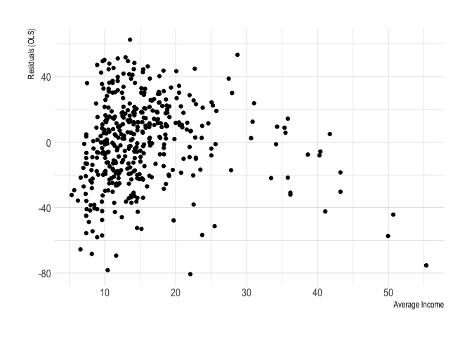<!-- -->

```r
# Student Teacher Ratio
ggplot(data = Caschool, aes(x = str, y = resid1)) + 
  geom_point() +
  labs(x = "Student Teacher Ratio", y = "Residuals (OLS)")
```

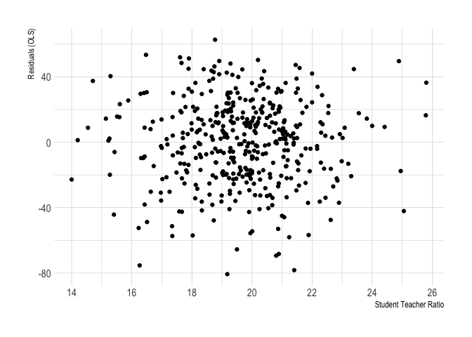<!-- -->

```r
# Enrollment 
ggplot(data = Caschool, aes(x = enrltot, y = resid1)) + 
  geom_point() +
  labs(x = "Total Enrollment", y = "Residuals (OLS)")
```

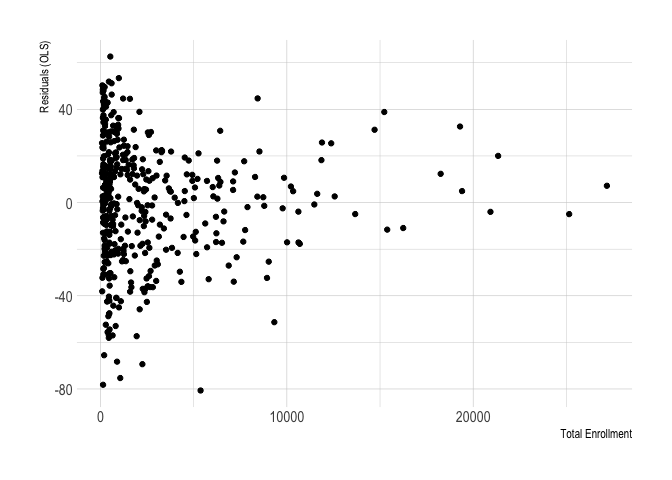<!-- -->

```r
# Expenditures 
ggplot(data = Caschool, aes(x = expnstu, y = resid1)) + 
  geom_point() +
  labs(x = "Expenditure per student", y = "Residuals (OLS)")
```

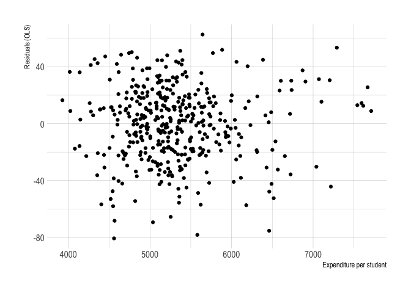<!-- -->

**Q10**: Does it appear as though our disturbances are heteroskedastic? Explain!  
**Q11**: Why do we care about heteroskedasticity?  


Before we get into running tests for heteroskedasticity, lets try one of the quick solutions: statistical transformations. 

**Q12**: How would statistical transformations help us?  

**A12**: Misspecification of the functional form of the model mechanically creates heteroskedasticity!  

Let's start with a log-linear specification. 


```r
#Let's run a regression with  the form log(y) = x1 + x2 + ...
mod_loglin = lm(data = Caschool, log(total_score) ~ avginc + str + enrltot + expnstu)

summary(mod_loglin)
```

```
## 
## Call:
## lm(formula = log(total_score) ~ avginc + str + enrltot + expnstu, 
##     data = Caschool)
## 
## Residuals:
##       Min        1Q    Median        3Q       Max 
## -0.062242 -0.013791  0.001899  0.013943  0.047353 
## 
## Coefficients:
##               Estimate Std. Error t value Pr(>|t|)    
## (Intercept)  7.182e+00  2.148e-02 334.384  < 2e-16 ***
## avginc       2.929e-03  1.428e-04  20.508  < 2e-16 ***
## str         -1.101e-03  6.888e-04  -1.599   0.1106    
## enrltot     -1.224e-06  2.632e-07  -4.649  4.5e-06 ***
## expnstu     -4.825e-06  2.017e-06  -2.393   0.0172 *  
## ---
## Signif. codes:  0 '***' 0.001 '**' 0.01 '*' 0.05 '.' 0.1 ' ' 1
## 
## Residual standard error: 0.01995 on 415 degrees of freedom
## Multiple R-squared:  0.5348,	Adjusted R-squared:  0.5303 
## F-statistic: 119.3 on 4 and 415 DF,  p-value: < 2.2e-16
```

**Q13**: How do we interpret the coefficient on `expenstu` now?   

We can plot the new residuals to see if this has helped with our heteroskedasticity problem. Here, we can use `ggplot::qplot()` for a "quick" plot of x vs y. 


```r
qplot(Caschool$avginc, resid(mod_loglin))
```

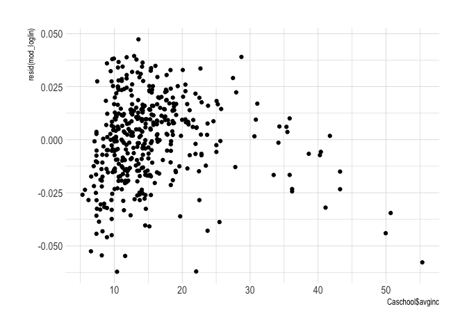<!-- -->

```r
qplot(Caschool$str, resid(mod_loglin))
```

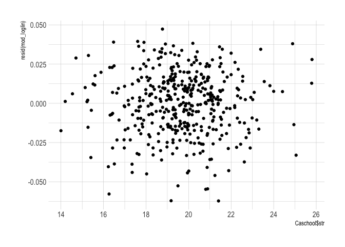<!-- -->

```r
qplot(Caschool$enrltot, resid(mod_loglin))
```

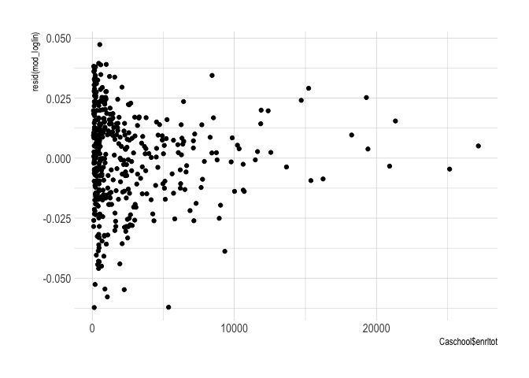<!-- -->

```r
qplot(Caschool$expnstu, resid(mod_loglin))
```

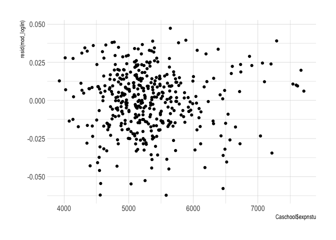<!-- -->

The residual plots are still showing evidence of heteroskedasticity. Let's try a log-log specification.  


```r
#our form is now log(Y) = log(X1) + log(X2)...
mod_loglog = lm(data = Caschool, log(total_score) ~ log(avginc) + log(str) + log(enrltot) + log(expnstu))
```
 
And we can use `qplot()` again to check the residual plots quickly.


```r
qplot(log(Caschool$avginc), resid(mod_loglog))
```

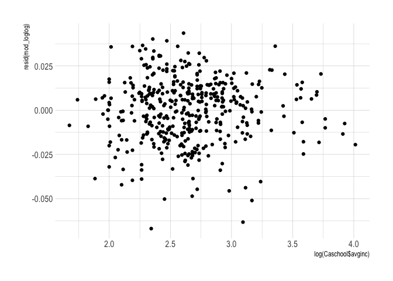<!-- -->

```r
qplot(log(Caschool$str), resid(mod_loglog))
```

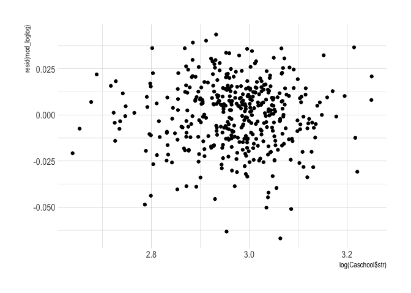<!-- -->

```r
qplot(log(Caschool$enrltot), resid(mod_loglog))
```

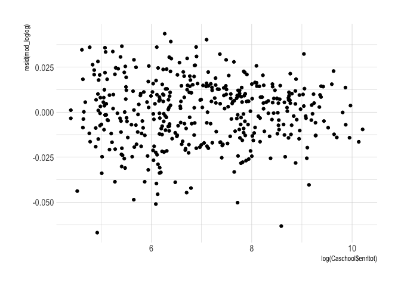<!-- -->

```r
qplot(log(Caschool$expnstu), resid(mod_loglog))
```

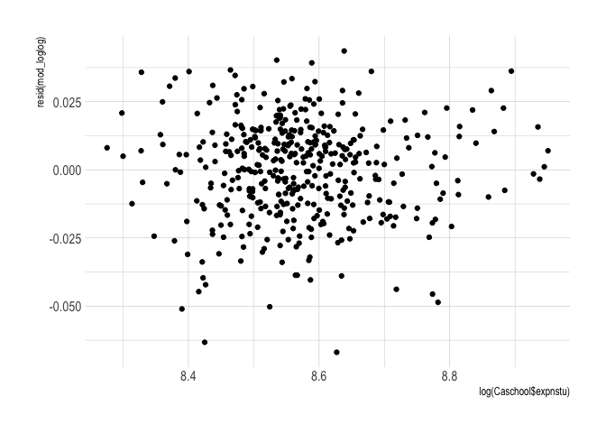<!-- -->

These actually look much more homoskedastic -- but we can't just rely on visual assessment, we need a statistical test that will much more accurately measure what we are trying to see with our eyes here -- whether the variance of the residuals is constant across values of our explanatory variables. 

Let's try to get some intuition for the tests by running a quick regression -- let's regress the squared residuals on our explanatory variables. What are we trying to determine here? Whether there is a relationship between the our $x$'s and the variance of the residuals. 


```r
# First lets add the residuals from the log-log regression 
Caschool %<>% mutate(resid_loglog = resid(mod_loglog))

# Now regress the squared residuals on explanatory variables 
mod_check = lm(data = Caschool, I(resid_loglog^2) ~ log(avginc) + log(str) + log(enrltot) + log(expnstu))

summary(mod_check)
```

```
## 
## Call:
## lm(formula = I(resid_loglog^2) ~ log(avginc) + log(str) + log(enrltot) + 
##     log(expnstu), data = Caschool)
## 
## Residuals:
##        Min         1Q     Median         3Q        Max 
## -0.0005300 -0.0002566 -0.0001385  0.0000746  0.0040308 
## 
## Coefficients:
##                Estimate Std. Error t value Pr(>|t|)    
## (Intercept)   3.923e-03  3.050e-03   1.286 0.199066    
## log(avginc)  -2.380e-06  6.502e-05  -0.037 0.970811    
## log(str)      4.817e-05  3.400e-04   0.142 0.887396    
## log(enrltot) -6.942e-05  1.927e-05  -3.603 0.000353 ***
## log(expnstu) -3.794e-04  2.759e-04  -1.375 0.169936    
## ---
## Signif. codes:  0 '***' 0.001 '**' 0.01 '*' 0.05 '.' 0.1 ' ' 1
## 
## Residual standard error: 0.0004938 on 415 degrees of freedom
## Multiple R-squared:  0.03944,	Adjusted R-squared:  0.03018 
## F-statistic:  4.26 on 4 and 415 DF,  p-value: 0.002173
```

Seems like there is at least some sort of relationship here. There is a significant coefficient and the $R^2$ is non-zero (but small). Let's use the tests you have learned in class to more formally dig into this.  


# The Goldfeld-Quant Test  

I am going to stress the intuition of these tests, because it is easy to get lost in statistics and formula land when working through these. What exactly do we want out of a heteroskedasticity test? We want to be **sure** that the variance of the residuals isn't changing with our predictors. There are many potential ways to do that, and the G-Q test takes a relatively simple approach.  

One way to see if the variance of the residuals is changing with predictors is to compare different values of our predicted variable and see if there is different variance among the residuals. That's what the G-Q test is trying to do! But we need a process. We already have all of the tools we need to run this test!  

First, we need to split our data into two groups using values of one of the explanatory variables. The exact fraction that goes into each group doesn't matter so much, we just want one group that has high values for the explanatory variable and one group that has low values. People typically use groups size $\frac{3}{8}n$.  

Once the data is split, we run the regression on the two groups separately and compare the variance of the residuals by taking the ratio of the sum of the squared errors Let's think about the meaning of this ratio. 

**Q14**: What would it mean for the ratio of SSE's to be close to 1? What about the ratio being large?   

This test statistic is distributed according to the $F_{n-k,n-k}$ distribution, which we can use to determine how unusually large the ratio is by calculating the p-value. Note that $n$ is the number of observations in each subset and $k$ is the number of parameters estimated, including the intercept. 

*Note: that Goldfeld-Quant only allows you to look at one variable at a time. Let's focus on income at the moment*

OK let's get on to actually implementing the G-Q test manually in six steps.

### Step 1:  Order your observations by your variable of interest

We're going to focus on the original level-level regression (`mod_ols`) and the income variable `avginc`. It looked the worst in our graphs, so it makes sense to check here.


```r
# Sort data using arrange
Caschool %<>% arrange(avginc)

# Checking to make sure it worked
head(Caschool)
```

```
##    distcod        county                    district grspan enrltot teachers
## 13   71795        Tulare      Allensworth Elementary  KK-08     103     5.00
## 20   63560          Kern           Lamont Elementary  KK-08    2688   135.00
## 17   63594          Kern Lost Hills Union Elementary  KK-08     491    28.92
## 7    68536   San Joaquin       Holt Union Elementary  KK-08     195    10.00
## 31   68379     San Diego       San Ysidro Elementary  KK-08    4142   201.00
## 75   69203 Santa Barbara  Guadalupe Union Elementary  KK-08    1088    55.00
##    calwpct mealpct computer testscr    compstu  expnstu      str avginc
## 13 22.4299 98.1308       25  616.30 0.24271844 6567.149 20.60000  5.335
## 20 23.4375 93.2292      139  620.30 0.05171131 5433.593 19.91111  5.699
## 17 11.2016 97.7597      100  618.05 0.20366599 6723.238 16.97787  6.216
## 7  12.9032 94.6237       28  606.75 0.14358975 5253.331 19.50000  6.577
## 31 35.5625 81.5065      569  624.55 0.13737325 5342.233 20.60697  6.613
## 75 14.1544 86.0294      107  634.90 0.09834559 4136.251 19.78182  6.983
##       elpct readscr mathscr total_score    resid1 resid_loglog
## 13 42.71844   612.8   619.8      1232.6 -32.28062 -0.008573221
## 20 49.81399   621.3   619.3      1240.6 -29.34424  0.005894453
## 17 85.53972   611.7   624.4      1236.1 -35.66959 -0.009099679
## 7  68.71795   604.5   609.0      1213.5 -65.51728 -0.038674238
## 31 80.42009   620.4   628.7      1249.1 -21.61554  0.006242733
## 75 64.24632   631.1   638.7      1269.8 -15.71452  0.006983782
```

we can see `avginc` is increasing, so the sorting has worked.

### Step 2:  Split the data into two groups

We've chosen to be three-eighths to be our sample size, so we need to know what $\frac{3}{8}$ of our dataset is. 


```r
# Getting count closest to 3/8 of our sample
(n_GQ = as.integer((3/8)*nrow(Caschool)))
```

```
## [1] 157
```


### Step 3:  Run seperate regressions of y (`total_score`) on x (`avginc`) for each of the two groups 

We can do this with clever use of our `head` and `tail` commands.  


```r
# First for high values of income
mod_g1 = lm(
  data = tail(Caschool, n = n_GQ), 
  total_score ~ avginc + str + enrltot + expnstu
) 
# Now for low values of income 
mod_g2 = lm(
  data = head(Caschool, n_GQ), 
  total_score ~ avginc + str + enrltot + expnstu
)
```

### Step 4: Calculate the Sum of Squared Errors 

We need to recover the SSEs for our test, so we need to build those. We'll use the `sum()` command, as well as our `resid()` command we just learned to do this.  


```r
# First getting residuals from both regressions 
e_g1 = resid(mod_g1) 
e_g2 = resid(mod_g2)

# Then summing their squares 
sse_g1 = sum(e_g1 ^ 2) 
sse_g2 = sum(e_g2 ^ 2)
```

### Step 5: Calculate the G-Q test statistic and its p-value.  

**Q15**: How do we calculate the test statistic from the two group's SSE?  


```r
# Ratio of SSE is test statistic
(stat_GQ = (sse_g2 / sse_g1))
```

```
## [1] 1.39631
```

This number is not very useful unless we are able to see how it compares to what we expect the distribution to be. Luckily, someone who is good at math proved that the G-Q test statistic is distributed according to the $F_{n-k,n-k}$ distribution, where $n$ is the number of observations in each group and $k$ is the number of coefficients we are estimating. Let's check to see what percentile 1.3963097 is under the $F_{152,152}$ distribution using `pf()`. *Note: `152 = 157 - 5`*.


```r
# Getting the number of coefficients we estimated 
k = length(mod_ols$coefficients)

# pf gives probability from an f-dist
(p_GQ = pf(
  q = stat_GQ, 
  df1 = n_GQ - k, 
  df2 = n_GQ - k, 
  lower.tail = F
)) 
```

```
## [1] 0.02019347
```

**Q16** What is the *exact* null hypothesis that we are testing here? What does the p-value suggest about this null hypothesis?  

In general, any distribution you can think of has a set of functions you can use in `R`. Generally, they are prefixed with r, p, q, and d. These correspond to:  

  - Draws from that distribution (r)  
  - Likelihood of seeing a number that size (p)  
  - The quantile (q) 
  - The density (d). 

Most often you'll see r and p used but the other ones are useful as well.


### Step 6: State the null hypothesis and draw conclusion, 

The *Null Hypothesis* of Goldfeld-Quant is...   

$H_0$: The variances of the residuals from regressions using the first 3/8 and the last 3/8 of the dataset ordered by average income are the same. $\sigma_1^2 = \sigma_2^2$

The *Alternative Hypothesis* of Goldfeld-Quant is...

$H_a$: The variances of the residuals from regressions using the first 3/8 and the last 3/8 of the dataset ordered by average income are different. $\sigma_1^2 \neq \sigma_2^2$

Conclusion, can we reject $H_0$?

Yes! At the 5% significance level. Let's look at another test.

# The White Test  

As discussed in class, the G-Q test will miss a lot of forms of heteroskedasticity, and we can only look at one explanatory variable at a time. The white test is more flexible, by letting the data tell us whether the residuals are correlated with the $x$'s. Basically, we are going to throw a bunch of terms at the squared residuals and see if there are any correlations. By a bunch of terms, I mean all of the `x`'s, their squared terms, and interactions between all of the `x`'s.  

This is similar (but better) than the Breusch-Pagan test -- come to office hours if you want me to explain the B-P test, but we are not going to talk about it today. 

The white test has four steps. We'll use the level-level regression again, `mod_ols`.

### Step 1: Run your main regression  

Same regression that we ran at the beginning.  


```r
# Levels regression  
mod_ols = lm(data = Caschool, total_score ~ avginc + str + enrltot + expnstu)
```

### Step 2: Regress residuals on `x`'s, and their squared terms plus interactions  

First, save the residuals. Then regress $e^2$ on an intercept, $x_1, x_2, ..., x_k$, interaction terms between them, and their squared terms.   


```r
# Getting the residuals  
e_white = resid(mod_ols)

# Regressing squared resids on terms 
mod_white = lm(
  data = Caschool, 
  I(e_white^2) ~ 
    # The x's
    avginc + str + enrltot + expnstu + 
    # Interaction terms
    avginc:str + avginc:enrltot + avginc:expnstu + str:enrltot + str:expnstu + enrltot:expnstu + 
    # Squared terms
    I(avginc^2) + I(str^2) + I(enrltot^2) + I(expnstu^2)
)

# Checking on the results 
summary(mod_white)
```

```
## 
## Call:
## lm(formula = I(e_white^2) ~ avginc + str + enrltot + expnstu + 
##     avginc:str + avginc:enrltot + avginc:expnstu + str:enrltot + 
##     str:expnstu + enrltot:expnstu + I(avginc^2) + I(str^2) + 
##     I(enrltot^2) + I(expnstu^2), data = Caschool)
## 
## Residuals:
##     Min      1Q  Median      3Q     Max 
## -1720.9  -504.2  -241.5   246.0  5730.0 
## 
## Coefficients:
##                   Estimate Std. Error t value Pr(>|t|)   
## (Intercept)      8.129e+02  1.525e+04   0.053  0.95752   
## avginc           3.067e+02  1.991e+02   1.540  0.12425   
## str              9.691e+01  9.400e+02   0.103  0.91794   
## enrltot          1.421e-01  4.233e-01   0.336  0.73726   
## expnstu         -1.169e+00  2.443e+00  -0.478  0.63256   
## I(avginc^2)      1.884e+00  5.817e-01   3.238  0.00130 **
## I(str^2)        -1.062e+00  1.487e+01  -0.071  0.94309   
## I(enrltot^2)     3.817e-06  1.578e-06   2.419  0.01599 * 
## I(expnstu^2)     6.289e-05  1.136e-04   0.554  0.58010   
## avginc:str      -1.617e+01  6.648e+00  -2.433  0.01540 * 
## avginc:enrltot   8.053e-03  2.990e-03   2.693  0.00737 **
## avginc:expnstu  -1.774e-02  1.499e-02  -1.184  0.23710   
## str:enrltot     -6.290e-03  1.122e-02  -0.560  0.57549   
## str:expnstu      3.816e-02  7.355e-02   0.519  0.60415   
## enrltot:expnstu -4.300e-05  4.257e-05  -1.010  0.31296   
## ---
## Signif. codes:  0 '***' 0.001 '**' 0.01 '*' 0.05 '.' 0.1 ' ' 1
## 
## Residual standard error: 881.5 on 405 degrees of freedom
## Multiple R-squared:  0.1284,	Adjusted R-squared:  0.09828 
## F-statistic: 4.262 on 14 and 405 DF,  p-value: 4.827e-07
```

We can see that a few of the coefficients are significant, but we might expect that some of them are randomly. Let's use $R^2$ to formally check whether our explanatory variables are jointly significant. 

### Step 3: Record the $R^2$ from the residuals regression  

This tells us how much of the variation in the squared residuals is explained by the `x`'s, their interaction terms, and their squared terms.  


```r
# Getting r-squared
(r2_white = summary(mod_white)$r.squared)
```

```
## [1] 0.1284066
```


### Step 4: Calculate the test statistic  

The test statistic here is $n \times R^2_e$, which is distributed according $\chi^2_k$. Here $k$ is the number of terms we've added to the regression (not including the intercept).  


```r
# First calculating the test statistic  
stat_white = nrow(Caschool) * r2_white 

# Calculating the p-value from chi-sq distribution
pchisq(q = stat_white, df = 14, lower.tail = F)
```

```
## [1] 1.320089e-06
```

**Q17**: What does this p-value tell us?  

# Solutions for heteroskedasticity  

OK, so we have determined that we do have heteroskedasticity, what do we do about it? At the beginning of the lab, we tried some different model specifications, which can help in some cases. However, it's nearly impossible to know whether you have the "correct" functional form. Instead, we can calculate our standard errors differently, in a way that is *robust* to heteroskedasticity (meaning -- they are still correct in the presence of heteroskedasticity).


### Heteroskedasticity robust standard errors 

We could calculate these on our own, but there is a package called `fixest` that can calculate these for us, as well as much more --- `fixest` is a new, very fast, and very powerful regression tool. It's regression function is `feols()`, which works very similarly to `lm()`. We just need to pass it data and a formula to start.

Reporting the heteroskedasticity robust standard errors is as simple as adding `vcov = "hetero"` as an argument to the summary function.


```r
# Loading package 
p_load(fixest)

# First let's run the original regression
mod_feols = feols(
  data = Caschool, 
  fml = total_score ~ avginc + str + enrltot + expnstu
)

# Usual standard errors 
summary(mod_feols)
```

```
## OLS estimation, Dep. Var.: total_score
## Observations: 420 
## Standard-errors: IID 
##                Estimate Std. Error  t value   Pr(>|t|)    
## (Intercept) 1312.920334  27.833430 47.17063  < 2.2e-16 ***
## avginc         3.864004   0.185093 20.87603  < 2.2e-16 ***
## str           -1.395436   0.892703 -1.56316 1.1878e-01    
## enrltot       -0.001611   0.000341 -4.72209 3.1984e-06 ***
## expnstu       -0.006052   0.002613 -2.31575 2.1059e-02 *  
## ---
## Signif. codes:  0 '***' 0.001 '**' 0.01 '*' 0.05 '.' 0.1 ' ' 1
## RMSE: 25.7   Adj. R2: 0.539501
```

```r
# Het-robust standard errors 
summary(mod_feols, vcov = "hetero")
```

```
## OLS estimation, Dep. Var.: total_score
## Observations: 420 
## Standard-errors: Heteroskedasticity-robust 
##                Estimate Std. Error  t value   Pr(>|t|)    
## (Intercept) 1312.920334  29.364467 44.71119  < 2.2e-16 ***
## avginc         3.864004   0.239715 16.11916  < 2.2e-16 ***
## str           -1.395436   0.931541 -1.49799 1.3490e-01    
## enrltot       -0.001611   0.000278 -5.79417 1.3591e-08 ***
## expnstu       -0.006052   0.002794 -2.16628 3.0858e-02 *  
## ---
## Signif. codes:  0 '***' 0.001 '**' 0.01 '*' 0.05 '.' 0.1 ' ' 1
## RMSE: 25.7   Adj. R2: 0.539501
```

In particular, look at how different the std errors are for income. 

**Q18**: Why did they change so much?  


### Weighted least squares 

Another solution to heteroskedasticity discussed in class is weighted least squares. To implement WLS, we can use the `weights = ` argument in `fixest::feols()`. Say we wanted to weight our regression by the number of teachers, then we just add that as a formula to the weights input: `weights = ~teachers`


```r
# First let's run the original regression
mod_wls = feols(
  data = Caschool, 
  fml = total_score ~ avginc + str + enrltot + expnstu,
  weights = ~teachers
)

# Summary of results 
summary(mod_wls)
```

```
## OLS estimation, Dep. Var.: total_score
## Observations: 420 
## Standard-errors: IID 
##                Estimate Std. Error   t value   Pr(>|t|)    
## (Intercept) 1283.479503  29.924709 42.890292  < 2.2e-16 ***
## avginc         4.359452   0.168081 25.936666  < 2.2e-16 ***
## str           -0.323835   0.893737 -0.362339 7.1728e-01    
## enrltot       -0.001029   0.000158 -6.522657 2.0127e-10 ***
## expnstu       -0.007042   0.002959 -2.380237 1.7752e-02 *  
## ---
## Signif. codes:  0 '***' 0.001 '**' 0.01 '*' 0.05 '.' 0.1 ' ' 1
## RMSE: 235.5   Adj. R2: 0.664625
```

### Cluster robust standard errors  

A slightly different type of heteroskedasticity can occur when the covariance between any two error terms does not equal zero. This could happen when observations belonging to a particular group might have correlated errors (i.e. counties within the same state have correlated error terms because they experience similar conditions). Similarly to heteroskedasticity, this clustering can be solved by calculating our standard errors in a different way. 

The `fixest` package makes this easy by giving us a `cluster` argument. Let's say we think the school-level errors from the model of test scores within a particular county are correlated, then we just have to add `cluster = ~county` to the regression. 


```r
# First let's run the original regression
mod_cluster = feols(
  data = Caschool, 
  fml = total_score ~ avginc + str + enrltot + expnstu,
  cluster = ~county
)

# Summary of results 
summary(mod_cluster)
```

```
## OLS estimation, Dep. Var.: total_score
## Observations: 420 
## Standard-errors: Clustered (county) 
##                Estimate Std. Error  t value   Pr(>|t|)    
## (Intercept) 1312.920334  33.732535 38.92148  < 2.2e-16 ***
## avginc         3.864004   0.360437 10.72034 7.4864e-14 ***
## str           -1.395436   0.983569 -1.41875 1.6302e-01    
## enrltot       -0.001611   0.000419 -3.84908 3.7988e-04 ***
## expnstu       -0.006052   0.003591 -1.68544 9.8985e-02 .  
## ---
## Signif. codes:  0 '***' 0.001 '**' 0.01 '*' 0.05 '.' 0.1 ' ' 1
## RMSE: 25.7   Adj. R2: 0.539501
```


That was a lot of information -- hopefully you'll come away with a little bit of better intuition for heteroskedasticity, and now you know how to check for it yourself! Next week we'll finish up with heteroskedasticity and I'll leave some time for questions on your second problem set. 


