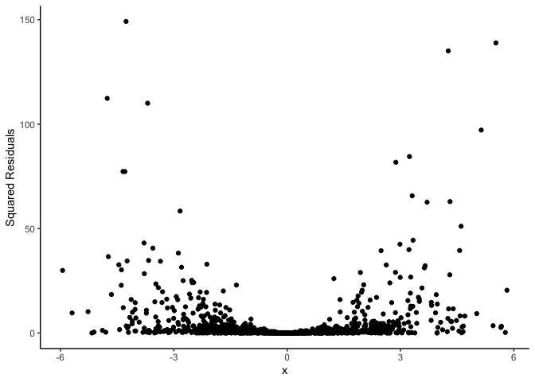
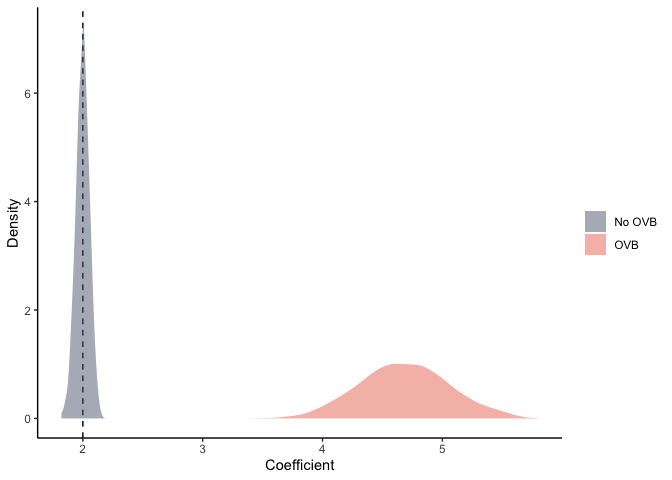
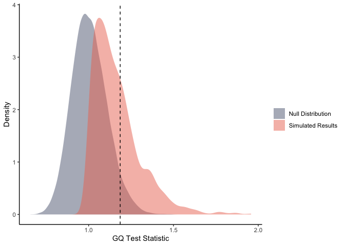
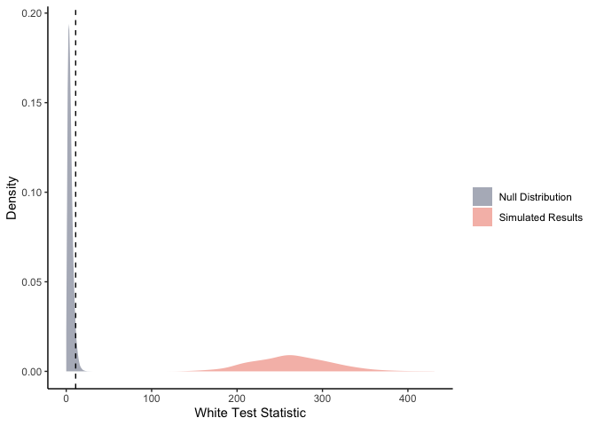
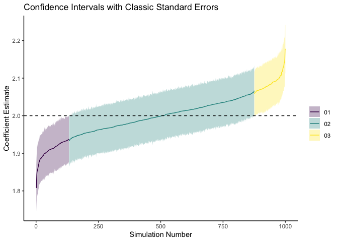
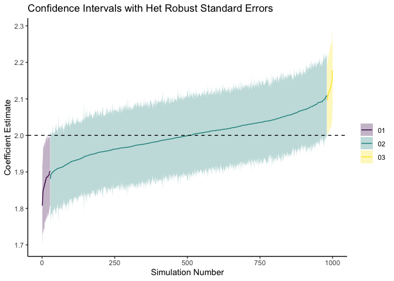

Today we are going to talk about writing our own functions in `R`. We have been using other people's functions all term, but lots of times no one has written the exact function you need, so you write your own!   

To demonstrate how to use functions, we'll be writing a simulation that will touch on a few of the key topics from class these last few weeks, namely omitted variable bias and heteroskedasticity.

# Function basics  

Functions are objects just like everything else we work with in `R`. For example, just run `lm` in your console without parentheses or any inputs. What comes out? The actual code that is executed when you run regressions with `lm`. Don't worry about understanding what is going on inside the `lm` function.

So what is a function (more generally than just in `R`)? It is something that maps an input to an output. Let's say we have the following function: $f(x) = x^2$, what $f(\cdot)$ does is take an input $x$ and give us an output $f(x)$, which is achieved by squaring the input. 

In `R` we can write functions using the following syntax, where `x`, `y`, and `z` are the inputs and `result` is the output:   

```
myfun = function(x,y,z){

  # Write code here
  result = doing something using x,y, and z
  
  # Give the result using return 
  return(result)
}
```

Let's write a function that will help us review for the midterm. The function will simulate some data that exhibits heteroskedasticity, which we can then use to run a regression and compare classic standard errors with heteroskedasticity robust standard errors. 

# Simulating a DGP  

Let's imagine that the true data generating process (DGP) is $y = \beta_0 + \beta_1 x + \beta_2 w + \epsilon$ where $\epsilon$ is our mean zero shock. However, lets make the variance of the error term depend on $x$, specifically $Var(\epsilon | x) = x^2$, thus violating our homoskedasticity assumption. Additionally, lets make $x$ and $w$ correlated. 


```r
# Loading packages
library(pacman)
p_load(tidyverse, fixest)

# Function to generate a dataset 
simulate_dgp = function(num_obs, b0 = 1, b1 = 2, b2 = 3, a = 0.05){

  # Creating data frame with the generated data
  sim_df = tibble(
    # Creating x and w 
    w = runif(n = num_obs, min = -15, max = 15),
    x = a*w  + rnorm(n = num_obs, mean = 0, sd = 2),
    # Generating error term
    eps = rnorm(num_obs, mean = 0, sd = sqrt(x^2)),
    # Calculating y
    y = b0 + b1*x + b2*w + eps
  )
  
  # Spitting out the results
  return(sim_df)
}
```

Now we can just run our new function like any other function! *Note: I have set default values for all of the parameters except `num_obs`, that way we can change them if we want to, but otherwise do not have to specify all four of them every time we want to run the function.*  


```r
# Setting the seed so that the results are reproducible
set.seed(219)

# Running our function!
one_sim_df = simulate_dgp(1e3)

# Plotting the results 
ggplot(data = one_sim_df, aes(x = x, y = y, color = w)) + 
  geom_point() + 
  scale_color_viridis_c() +
  theme_classic()
```

<!-- -->


## Exogeneity  

Great. Now that we have data that we **know** the DGP for, we can use those data to give us a behind the scenes look at two of the most important topics of the term: Exogeneity and heteroskedasticity. Let's suppose that as econometricians, we are interested in the effect of $x$ on $y$ and we *think* that the model is as follows

$$
y = \beta_0 + \beta_1 x + u
$$


**Q1**: Suppose we estimate this using OLS, will $\hat{\beta_1}$ be an unbiased estimator for $\beta_1$? Why or why not? What does exogeneity mean in this context?    

Let's actually run the regression to find out. Remember that we set `b1 = 2` by default when we created the `simulate_dgp` function. 


```r
# Fitting model 
mod_ovb = feols(y ~ x, data = one_sim_df)

# Summary of the results 
summary(mod_ovb)
```

```
## OLS estimation, Dep. Var.: y
## Observations: 1,000 
## Standard-errors: IID 
##             Estimate Std. Error   t value  Pr(>|t|)    
## (Intercept) 0.291182   0.795238  0.366157   0.71433    
## x           4.285692   0.382902 11.192667 < 2.2e-16 ***
## ---
## Signif. codes:  0 '***' 0.001 '**' 0.01 '*' 0.05 '.' 0.1 ' ' 1
## RMSE: 25.1   Adj. R2: 0.110637
```

So clearly we have an issue here, we know that $\beta_1 = 2$ by the regression we just ran gave us $\hat{\beta_1} =$ 4.3, which is pretty different from $2$. We know that this regression is suffering from omitted variable bias since $w$ is correlated with both $y$ and $x$. Let's run a new regression that includes $w$ and see what happens. 


```r
# Fitting model with w
mod_ols = feols(y ~ x + w, data = one_sim_df)

# Summary of the results 
summary(mod_ols)
```

```
## OLS estimation, Dep. Var.: y
## Observations: 1,000 
## Standard-errors: IID 
##             Estimate Std. Error  t value  Pr(>|t|)    
## (Intercept)  1.05590   0.068519  15.4103 < 2.2e-16 ***
## x            2.05858   0.033535  61.3868 < 2.2e-16 ***
## w            2.98872   0.008178 365.4584 < 2.2e-16 ***
## ---
## Signif. codes:  0 '***' 0.001 '**' 0.01 '*' 0.05 '.' 0.1 ' ' 1
## RMSE: 2.16184   Adj. R2: 0.993404
```

That looks better, the estimates for the coefficients are close to their true values, but aren't exactly the true values. 

**Q2**: How can we run a statistical test to see if the coefficient estimates are equal to the true values in the model?  

We can calculate confidence intervals!


```r
# Creating a df that calculates conf ints for our model
conf_int_df = tibble(
  term = names(coef(mod_ols)),
  coef = coef(mod_ols),
  std_err = se(mod_ols),
  ci_l = coef + std_err*qt(0.025, mod_ols$nobs - length(coefficients(mod_ols))),
  ci_h = coef + std_err*qt(0.975, mod_ols$nobs - length(coefficients(mod_ols)))
)

conf_int_df
```

```
## # A tibble: 3 × 5
##   term         coef std_err  ci_l  ci_h
##   <chr>       <dbl>   <dbl> <dbl> <dbl>
## 1 (Intercept)  1.06 0.0685  0.921  1.19
## 2 x            2.06 0.0335  1.99   2.12
## 3 w            2.99 0.00818 2.97   3.00
```

So the true model parameters fall well within the 95% confidence intervals.  


**Q3**: Are these standard errors correct? Why or why not?    

As described when I introduced the DGP, we have heteroskedasticity here. 

**Q4**: Are the point estimates still unbiased even if we violate homoskedasticity?  

## Heteroskedasticity  

Let's write functions ourselves that can run the GQ and white tests for us for the given data. 


```r
# Function to run GQ test
gq_test = function(sim_df){
  
  # Number of obs for each group
  n_gq = as.integer(nrow(sim_df)*(3/8))
  
  # Sorting the data
  sim_df = arrange(sim_df, x)
  
  # Grouped regressions 
  mod_g1 = lm(y ~ x + w, data = head(sim_df, n = n_gq))
  mod_g2 = lm(y ~ x + w, data = tail(sim_df, n = n_gq))
  
  # Getting residuals to calculate SSE 
  sse_g1 = sum(resid(mod_g1)^2)
  sse_g2 = sum(resid(mod_g2)^2)
  
  # Calculating test stat (Making sure bigger sse is on top)
  stat_gq = max(sse_g2/sse_g1,sse_g1/sse_g2)
  
  # Calculating p value 
  p_gq = 1-pf(stat_gq, df1 = n_gq - 3, df2 = n_gq - 3)
  
  # Returning the results 
  return(list(test_stat = stat_gq,p_value = p_gq))
  
}

# Running the gq test
gq_test(one_sim_df)
```

```
## $test_stat
## [1] 1.035018
## 
## $p_value
## [1] 0.3700603
```

**Q5**: Interpret the results of the GQ test we just ran.  

Now we can run the white test as well, writing a new function to do that for us.


```r
# Function to run the white test
white_test = function(sim_df){
  
  # First running original regression 
  mod_ols = lm(y ~ x + w, data = sim_df)
  
  # Now running regression with residuals 
  mod_white = lm(I(resid(mod_ols)^2) ~ x + w + I(x^2) + I(w^2) + x:w, data = sim_df)
  
  # Calculating test statistic 
  stat_white = nrow(sim_df)*summary(mod_white)$r.squared
  
  # Calculating p-value
  p_white = 1-pchisq(stat_white, df = length(coef(mod_white)) - 1)
  
  # Returning the results 
  return(list(test_stat = stat_white, p_value = p_white))
}


white_test(one_sim_df)
```

```
## $test_stat
## [1] 217.0214
## 
## $p_value
## [1] 0
```


**Q6**: Interpret the results of the white test we just ran. 

While there is evidence for heteroskedasticity from both tests, the GQ test leaves things a bit ambiguously since we cannot reject at the 5% level. However, the null hypothesis on the white test can clearly be rejected. 

Let's plot the residuals just to make sure we understand why the GQ test is not very good at picking this type of heteroskedasticity up. 


```r
# Adding residuals to data
one_sim_df$resid_ols = resid(mod_ols)

# Plotting squared residuals vs x
ggplot(data = one_sim_df, aes(x = x, y = resid_ols^2)) +
  geom_point() + 
  labs(y = "Squared Residuals") + 
  theme_classic()
```

<!-- -->

Now that we know there is heteroskedasticity present. Let's correct for it using heteroskedasticity robust standard errors. Since we used `fixest`, this is as simple as adding `vcov = "HC1"` to the summary function.  


```r
# Comparing classic to het robust.
summary(mod_ols)
```

```
## OLS estimation, Dep. Var.: y
## Observations: 1,000 
## Standard-errors: IID 
##             Estimate Std. Error  t value  Pr(>|t|)    
## (Intercept)  1.05590   0.068519  15.4103 < 2.2e-16 ***
## x            2.05858   0.033535  61.3868 < 2.2e-16 ***
## w            2.98872   0.008178 365.4584 < 2.2e-16 ***
## ---
## Signif. codes:  0 '***' 0.001 '**' 0.01 '*' 0.05 '.' 0.1 ' ' 1
## RMSE: 2.16184   Adj. R2: 0.993404
```

```r
summary(mod_ols, vcov = "HC1")
```

```
## OLS estimation, Dep. Var.: y
## Observations: 1,000 
## Standard-errors: Heteroskedasticity-robust 
##             Estimate Std. Error  t value  Pr(>|t|)    
## (Intercept)  1.05590   0.068462  15.4232 < 2.2e-16 ***
## x            2.05858   0.055636  37.0010 < 2.2e-16 ***
## w            2.98872   0.007719 387.2008 < 2.2e-16 ***
## ---
## Signif. codes:  0 '***' 0.001 '**' 0.01 '*' 0.05 '.' 0.1 ' ' 1
## RMSE: 2.16184   Adj. R2: 0.993404
```

OK, that was a whirlwind. But we haven't really used the full potential of simulation, we have only done all of this work for a single simulated data set, but we can do this many times to create a distribution for all of the things we calculated. 

# For loops  

For loops are one way that we can do something over and over again without having to manually run code hundreds of times. The syntax is `for(value in sequence){ do something }`. For example 


```r
# Simple for loop
for(i in 1:3){
  print(i)
}
```

```
## [1] 1
## [1] 2
## [1] 3
```

The loop starts by setting `i` to the first value in the sequence `1:3`, then runs the code with `i=1`. Once it finishes, it sets `i=2` and runs the code again. This continues until it gets to the last value in the sequence. 

Let's use a for loop to run our simulation 1000 times. For each simulation, we'll grab coefficients for $x$ from regressions with and without $w$, classic standard errors and het robust standard errors, and we'll run the GQ and White tests.  


```r
# We have to initialize the results df we want to add rows to
sim_res_df = tibble()

# Setting for loop up to run 1000 iterations
for(i in 1:1e3){
  # Generating the data
  sim_df = simulate_dgp(1000)
  
  # Running models 
  mod_ovb = feols(data = sim_df, fml = y~x)
  mod_ols = feols(data = sim_df, fml = y~x+w)
  
  # Running heteroskedasticity tests
  gq_res = gq_test(sim_df)
  white_res = white_test(sim_df)
  
  # Calculating confidence intervals and results
  one_sim_res_df = tibble(
    # Saving the iteration number 
    iter = i,
    # Coefficients
    coef = coef(mod_ols, keep = "x"),
    coef_ovb = coef(mod_ovb, keep = "x"),
    # Classic standard errors
    std_err = se(mod_ols, keep = "x"),
    ci_l = coef + std_err*qt(0.025, mod_ols$nobs - length(coefficients(mod_ols))),
    ci_h = coef + std_err*qt(0.975, mod_ols$nobs - length(coefficients(mod_ols))),
    # Het robust standard errors
    std_err_het = se(mod_ols, vcov = "hc1", keep ="x"),
    ci_l_het = coef + std_err_het*qt(0.025, mod_ols$nobs - length(coefficients(mod_ols))),
    ci_h_het = coef + std_err_het*qt(0.975, mod_ols$nobs - length(coefficients(mod_ols))),
    # Test results
    gq_stat = gq_res$test_stat,
    gq_p_val = gq_res$p_value,
    white_stat = white_res$test_stat,
    white_p_val = white_res$p_value
  )
  
  # Adding the results to data frame
  sim_res_df = rbind(sim_res_df, one_sim_res_df)
}


# Lets look at what the result was
sim_res_df
```

```
## # A tibble: 1,000 × 13
##     iter  coef coef_ovb std_err  ci_l  ci_h std_err_het ci_l_het ci_h_het
##    <int> <dbl>    <dbl>   <dbl> <dbl> <dbl>       <dbl>    <dbl>    <dbl>
##  1     1  2.05     4.71  0.0323  1.98  2.11      0.0522     1.94     2.15
##  2     2  1.96     4.12  0.0331  1.90  2.03      0.0575     1.85     2.07
##  3     3  2.04     5.49  0.0322  1.98  2.10      0.0547     1.93     2.15
##  4     4  2.06     4.67  0.0309  2.00  2.12      0.0535     1.96     2.17
##  5     5  1.94     4.61  0.0310  1.88  2.00      0.0485     1.84     2.03
##  6     6  1.97     4.88  0.0337  1.91  2.04      0.0569     1.86     2.09
##  7     7  2.07     4.32  0.0319  2.01  2.13      0.0538     1.97     2.18
##  8     8  2.02     4.45  0.0322  1.96  2.08      0.0559     1.91     2.13
##  9     9  1.97     3.77  0.0316  1.91  2.03      0.0586     1.85     2.08
## 10    10  1.92     4.86  0.0330  1.85  1.98      0.0578     1.81     2.03
## # … with 990 more rows, and 4 more variables: gq_stat <dbl>, gq_p_val <dbl>,
## #   white_stat <dbl>, white_p_val <dbl>
```

Great, now that we have the simulation results, we can plot the distribution of some of the values to see how different they are. Let's start by comparing the regression suffering from OVB to the properly specified regression. 


```r
# Plotting distribution of coefficient estimates for OVB and no OVB models
sim_res_df |>
  select(coef, coef_ovb) |>
  pivot_longer(cols = 1:2) |>
  ggplot(aes(x = value, fill = name)) +
  geom_vline(xintercept = 2, linetype = "dashed") +
  geom_density(alpha = 0.5, color = NA) +
  labs(x = "Coefficient", y = "Density") +
  scale_fill_manual(
    name = "", 
    values = c("#5f6880", "#ec7662"),
    labels = c("No OVB", "OVB")
  ) + 
  theme_classic()
```

<!-- -->

The for loop we wrote above is fine, but it is a bit confusing and hard to understand what exactly we are doing for each iteration. Instead of writing the code inside the for loop, we can write a function that does the same, and then just create iterations using that function. 


```r
# Writing a function to get results from one iteration 
sim_res = function(i, n_obs = 1000){
  # Generating the data
  sim_df = simulate_dgp(n_obs)
  
  # Running models 
  mod_ovb = feols(data = sim_df, fml = y~x)
  mod_ols = feols(data = sim_df, fml = y~x+w)
  
  # Running heteroskedasticity tests
  gq_res = gq_test(sim_df)
  white_res = white_test(sim_df)
  
  # Calculating confidence intervals and results
  one_sim_res_df = tibble(
    # Saving the iteration number 
    iter = i,
    # Coefficients
    coef = coef(mod_ols, keep = "x"),
    coef_ovb = coef(mod_ovb, keep = "x"),
    # Classic standard errors
    std_err = se(mod_ols, keep = "x"),
    ci_l = coef + std_err*qt(0.025, mod_ols$nobs - length(coefficients(mod_ols))),
    ci_h = coef + std_err*qt(0.975, mod_ols$nobs - length(coefficients(mod_ols))),
    # Het robust standard errors
    std_err_het = se(mod_ols, vcov = "hc1", keep ="x"),
    ci_l_het = coef + std_err_het*qt(0.025, mod_ols$nobs - length(coefficients(mod_ols))),
    ci_h_het = coef + std_err_het*qt(0.975, mod_ols$nobs - length(coefficients(mod_ols))),
    # Test results
    gq_stat = gq_res$test_stat,
    gq_p_val = gq_res$p_value,
    white_stat = white_res$test_stat,
    white_p_val = white_res$p_value
  )
  
  # Adding the results to data frame
  return(one_sim_res_df)
}

# Testing what sim_res does
sim_res(1)
```

```
## # A tibble: 1 × 13
##    iter  coef coef_ovb std_err  ci_l  ci_h std_err_het ci_l_het ci_h_het gq_stat
##   <dbl> <dbl>    <dbl>   <dbl> <dbl> <dbl>       <dbl>    <dbl>    <dbl>   <dbl>
## 1     1  2.08     5.08  0.0320  2.02  2.14      0.0542     1.98     2.19    1.03
## # … with 3 more variables: gq_p_val <dbl>, white_stat <dbl>, white_p_val <dbl>
```

```r
# We have to initialize the results df we want to add rows to
sim_res_df = tibble()
# Setting for loop up to run 1000 iterations
for(i in 1:1e3){
  # Running the simulation
  one_sim_res_df = sim_res(i)
  # Adding results to table
  sim_res_df = rbind(sim_res_df, one_sim_res_df)
}

# Checking on the results 
sim_res_df
```

```
## # A tibble: 1,000 × 13
##     iter  coef coef_ovb std_err  ci_l  ci_h std_err_het ci_l_het ci_h_het
##    <int> <dbl>    <dbl>   <dbl> <dbl> <dbl>       <dbl>    <dbl>    <dbl>
##  1     1  1.99     4.77  0.0317  1.93  2.05      0.0518     1.89     2.09
##  2     2  2.03     4.93  0.0320  1.97  2.09      0.0548     1.92     2.14
##  3     3  2.01     4.92  0.0335  1.94  2.07      0.0583     1.89     2.12
##  4     4  2.08     4.48  0.0332  2.01  2.14      0.0576     1.96     2.19
##  5     5  2.03     4.30  0.0308  1.97  2.09      0.0499     1.93     2.13
##  6     6  2.04     4.80  0.0334  1.98  2.11      0.0651     1.92     2.17
##  7     7  2.01     4.56  0.0333  1.95  2.08      0.0583     1.90     2.13
##  8     8  1.99     5.02  0.0317  1.93  2.06      0.0565     1.88     2.10
##  9     9  1.96     4.65  0.0342  1.89  2.03      0.0581     1.84     2.07
## 10    10  1.96     3.99  0.0313  1.89  2.02      0.0506     1.86     2.05
## # … with 990 more rows, and 4 more variables: gq_stat <dbl>, gq_p_val <dbl>,
## #   white_stat <dbl>, white_p_val <dbl>
```

We've got the same simulation results we had before, but now lets check on the test statistic from our two heteroskedasticity tests to see how they are distributed. 


```r
# GQ Test
rbind(
  sim_res_df |> mutate(name = "Simulated")|> select(name, gq_stat) ,
  tibble(name = "Null Distribution", gq_stat = rf(1e5, df1 = 375-2, df2 = 375-2))
)|>
ggplot(aes(x = gq_stat, fill = name)) +
  geom_density(alpha = 0.5, color = NA) +
  geom_vline(xintercept = qf(0.95, df1 = 375-2, df2 = 375-2), linetype = "dashed") +
  scale_fill_manual(
    name = "", 
    values = c("#5f6880", "#ec7662"),
    labels = c("Null Distribution", "Simulated Results")
  ) +
  labs(x = "GQ Test Statistic", y = "Density") +
  theme_classic()
```

<!-- -->

```r
# White test
rbind(
  sim_res_df |> mutate(name = "Simulated")|> select(name, white_stat) ,
  tibble(name = "Null Distribution", white_stat = rchisq(1e5, df = 5))
)|>
ggplot(aes(x = white_stat, fill = name)) +
  geom_density(alpha = 0.5, color = NA) +
  geom_vline(xintercept = qchisq(0.95, df = 5), linetype = "dashed") +
  scale_fill_manual(
    name = "", 
    values = c("#5f6880", "#ec7662"),
    labels = c("Null Distribution", "Simulated Results")
  ) +
  labs(x = "White Test Statistic", y = "Density") +
  theme_classic()
```

<!-- -->

**Q7**: What do these plots tell you about the test statistics?  

The for loop we ran above is still a bit confusing and tedious though. We have to initialize the results data frame and keep track of some `i` that is being iterated over. Additionally we have to manually combine the results for each iteration. Luckily for us there is an easier way. 

# Functional programming 

Functional programming broadly refers to when you do things in your code via functions, and your script is made up of calls to those functions. Functions are particularly useful when you have do to the same task over and over again. Rather than copying and pasting code over and over again and then manually changing a small part of the code, it is much more efficient (space and time wise) to just write that bit of code that takes whatever input you want to change as an argument. It also drastically reduces the risk of typos since there is only one version of the code rather than many. 

This all applies to for loops above, but there are some functions in `R` that make for loops easier and more intuitive. I am going to use the `purrr` package (part of the `tidyverse`), which has a function called `map`, which takes a vector as one argument and a function as the other. It then runs the function on each value of the input. Let's look at an example.


```r
# Simple function that squares the input
xsq = function(x){x^2}

# Example using map 
map(1:5, xsq)
```

```
## [[1]]
## [1] 1
## 
## [[2]]
## [1] 4
## 
## [[3]]
## [1] 9
## 
## [[4]]
## [1] 16
## 
## [[5]]
## [1] 25
```

So how can we use this in our simulation above? We can take a vector, a sequence of the iteration number of the simulation, and map that to the function we wrote above that calculated all of the results. The `map_dfr` function acts exactly the same way, but instead of returning a list, it will return a data frame, which works if the output from the function is always a data frame. 


```r
# Running iterations of our simulation 
sim_res_df = map_dfr(1:1000,sim_res)
```

See how much simpler that is to write and understand than the for loop we wrote earlier?! One line gets us a thousand iterations! There is a lot more to be said about functional programming, but I don't have time to get into the weeds today. Instead, let's get back to looking at the results of our simulation, this time we are going to compare classic standard errors to heteroskedasticity robust standard errors.

What do we mean when we say that classic standard errors are "wrong" in the presence of heteroskedasticity. Well, we can demonstrate using confidence intervals --  if our standard errors are correct, then 95% of our confidence intervals should contain the true parameter. 


```r
sim_res_df |>
  mutate(
    in_conf = case_when(
      ci_h <= 2 ~ "01",
      ci_l >= 2 ~ "03",
      TRUE ~ "02"
    )
  ) |>
  arrange(in_conf, coef) |>
  mutate(n = row_number()) |>
  ggplot(aes(x = n, y = coef, color = in_conf, fill = in_conf)) +
  geom_line() + 
  geom_ribbon(aes(ymin = ci_l, ymax = ci_h), alpha = 0.3, color = NA) +
  geom_hline(yintercept = 2, linetype = "dashed") + 
  labs(
    title = "Confidence Intervals with Classic Standard Errors",
    x = "Simulation Number",
    y = "Coefficient Estimate"
  ) + 
  scale_fill_viridis_d(name = "")+ 
  scale_color_viridis_d(name = "") + 
  theme_classic()
```

<!-- -->

We can see that actually only 74.3% of the confidence intervals contain the true value using classic standard errors. What does that look like if we used heteroskedasticity robust standard errors? 


```r
sim_res_df |>
  mutate(
    in_conf = case_when(
      ci_h_het <= 2 ~ "01",
      ci_l_het >= 2 ~ "03",
      TRUE ~ "02"
    )
  ) |>
  arrange(in_conf, coef) |>
  mutate(n = row_number()) |>
  ggplot(aes(x = n, y = coef, color = in_conf, fill = in_conf)) +
  geom_line() + 
  geom_ribbon(aes(ymin = ci_l_het, ymax = ci_h_het), alpha = 0.3, color = NA) +
  geom_hline(yintercept = 2, linetype = "dashed") + 
  labs(
    title = "Confidence Intervals with Het Robust Standard Errors",
    x = "Simulation Number",
    y = "Coefficient Estimate"
  ) + 
  scale_fill_viridis_d(name = "")+ 
  scale_color_viridis_d(name = "") + 
  theme_classic()
```

<!-- -->

This time 95.2% of the confidence intervals contain the true value using heteroskedasticity robust standard errors.  
