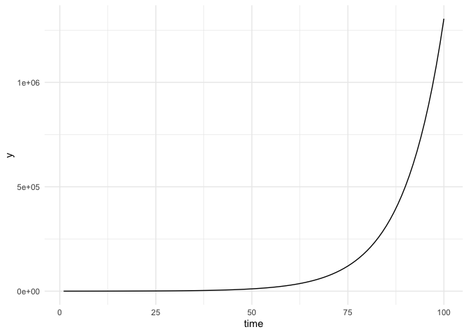

Today we are going to do some time series simulations. In order to run these, we will be using functions, which we talked about a few weeks ago. 

# Function review  

Let's start by doing a little review on how to write functions. Let's write a function that calculates the t-stat of a coefficient estimate for a given null hypothesis. Remember that the syntax for writing a function is like `myfun = function(x){y = f(x)  return(y)}`.


```r
# Function to calculate a t-stat
calc_tstat = function(coef_est, coef_null, std_error){
  
  # Calculating t-stat 
  tstat = (coef_est - coef_null)/std_error
  
  # Returning the result
  return(tstat)
}
```

Great, now lets actually run it to calculate the t-stat.


```r
calc_tstat(3, 2, std_error = 0.2)
```

```
## [1] 5
```


# Simulating an $\text{ADL}(1,1)$ model

We'll be simulating an $\text{ADL}(1,1)$ model. What does ADL stand for? 

**A**utocorrelated **D**istributed **L**ag. Let’s walk through these terms.

What does Autocorrelated mean? Auto: *self, directed from within* (Greek). Correlated: *a phenomenon that accompanies another phenomenon, is usually parallel to it, and is related in some way to it* (Merriam Webster).

So in total, this means an ADL model is in some way self-related. In practice, you guys will use autocorrelation to be purely related to time, that is, objects are related to recent observations. However, autocorrelation can also show up in other ways, for instance, in spatial autocorrelation where data that is collected from places close to one another are correlated.

Distributed Lag: This is describing some variable $x$ where the impact of $x$ on our outcome $y$ happens over several periods, that is, $X_t$ at $t=T$ and $X_t$ at $t=T-1$ will *both* affect $y_T$. As an example:   

Building new roads, for instance, may have an effect on commute times today. Maybe we believe that opening some new roads will reduce congestion. However, it’s possible that drivers take some time to really start using these roads efficiently, so those new roads will also impact commutes next month too. Let’s think of some way of simulating this data, where $t$ is in months, and $x$ will be thousands of dollars invested in roads.


Let's write a function that simulates an $\text{ADL}(1,1)$ model:  

$$y_t = \beta_0 + \beta_1 x_t + \beta_2 x_{t-1} + \alpha_1 y_{t-1} +u_t$$

where $u_t \sim N(0, \sigma^2)$ and $x_t \sim N(10, 2.5)$. So we have that commute time in month $t$, $y_t$, is determined by the commute time in the previous month, $y_{t-1}$, the road funding in month $t$, $x_{t}$, the road funding the previous month, $x_{t-1}$, and a random disturbance $u_t$.

## Setting up the simulation  

In order to simulate this, we need to do three main things  

1) Draw $T$ values of $u$ and $x$, where $T$ is the number of periods we simulate  
2) Set some starting point for $y$  
3) Generate $y$ data with a for loop, which lets us keep its time-dependent status.  


### Manually calculating the first period  

We'll write a function to do this, but first lets walk through step by step for just the first period before putting it into a function. First lets set all of our parameters. 


```r
# Parameters of model
b_0 = 10
b_1 = -1/6
b_2 = -1/3
a_1 = 1/2
# Std dev of disturbance
sigma = 10
```

$\beta_1 = -\frac{1}{6}$ means that for every thousand dollars spent on roads this month, commute times decrease by 10 seconds. $\beta_2 = -\frac{1}{3}$ means that for every thousand dollars spent on roads last month, commute times will decrease by 20 seconds this month. Finally $\alpha_1 = \frac{1}{2}$ tells us that commute times are largely determined by what they were last month.

Next can create vectors for $x$ and $u$, since they are just random variables. Since we just want the first period, we'll need two $x$'s ($x_0$ and $x_1$) and one $u$


```r
# Drawing two x's
x = rnorm(n = 2, mean = 10, sd = 2.5)
# Drawing one u
u = rnorm(n = 1, mean = 0, sd = sigma)
```

We have almost everything we need to calculate $y_1$, the only thing missing is $y_0$, which is some initial commute time. In models where you are simulating lagged dependent variables, you'll always need to set some starting point, here we'll pick a commute time of one hour. 


```r
# Setting initial value
y_0 = 60

# Calculating y_1
(y_1 = b_0 + b_1*x[2] + b_2*x[1] + a_1*y_0 + u)
```

```
## [1] 34.34724
```

So we have that the commute in the first month is 34 minutes. 


### Writing a function to do entire simulation  

We set up a function that takes an initial value for $y$, some $\beta$'s, an $\alpha$, a standard deviation parameter, and a number for our total number of observations.


```r
# Function that simulates ADL
ts_model = function(y_0, b_0, b_1, b_2, a_1, sigma, T){
  # First lets create x and u
  x = rnorm(n = T, mean = 10, sd = 2.5)
  u = rnorm(n = T, mean = 0, sd = sigma)
  
  # Initialize y as a vector
  y = c()
  # Set first observation to our provided level
  y[1] = y_0
  
  # Use loop to calculate rest of y's 
  for (t in 2:T){
    y[t] = b_0 + b_1*x[t] + b_2*x[t-1] + a_1*y[t-1] + u[t]
  }

  # Gathering the results 
  ts_df = tibble(
    time = 1:T, 
    y = y,
    y_lag = lag(y),
    x = x,
    x_lag = lag(x),
    u = u
  )
  
  # Returning the results 
  return(ts_df)
}

# Setting seed for reproducible results 
set.seed(7124)

# Lets grab one of our simulated data frames
ts_df = ts_model(
  y_0 = 60, 
  b_0 = 10,
  b_1 = -1/6,
  b_2 = -1/3,
  a_1 = 1/2,
  sigma = 10,
  T = 100
)

# Look at the results 
ts_df
```

```
## # A tibble: 100 × 6
##     time      y  y_lag     x x_lag        u
##    <int>  <dbl>  <dbl> <dbl> <dbl>    <dbl>
##  1     1 60     NA     12.8  NA     -0.0915
##  2     2 34.8   60     10.3  12.8    0.781 
##  3     3 22.0   34.8    9.54 10.3   -0.337 
##  4     4 26.7   22.0    4.42  9.54   9.60  
##  5     5 31.2   26.7    8.71  4.42  10.8   
##  6     6  3.16  31.2   11.5   8.71 -17.6   
##  7     7  8.83   3.16   7.00 11.5    2.25  
##  8     8  8.97   8.83  11.1   7.00  -1.27  
##  9     9  0.787  8.97   5.84 11.1   -9.03  
## 10    10  3.00   0.787 13.1   5.84  -3.26  
## # … with 90 more rows
```

Great, we have our simulated data, lets dig into it a bit to see what is going on. 

What are commute times in the final period?  


```r
ts_df |> filter(time == max(ts_df$time)) |> select(y)
```

```
## # A tibble: 1 × 1
##        y
##    <dbl>
## 1 -0.195
```

What if we wanted to know the period that had the lowest commute time? We can filter to the row where the commute time equals the minimum commute time. 


```r
ts_df |> filter(y == min(ts_df$y))
```

```
## # A tibble: 1 × 6
##    time     y   y_lag     x x_lag     u
##   <int> <dbl>   <dbl> <dbl> <dbl> <dbl>
## 1    65 -19.6 -0.0837  12.1  12.4 -23.4
```


## Plotting the results  

Great, now lets take a look at what we have actually done when we do one run of the simulation. It's *always* a good idea to plot data as you go. 


```r
ggplot(data = ts_df, aes(x = time, y = y)) +
  geom_line() 
```

<!-- -->

Note that having $|\alpha_1| < 1$ keeps the time series from exploding over time, or makes sure that the time series is "stationary." If you have $|\alpha_1| \geq 1$, then each period the entire value of the outcome variable (or more) is added to the outcome for the current time period, so it makes sense that the value of the outcome variable would explode over time. For example, if we set `a_1 = 1`, we get  


```r
ts_model(
  y_0 = 60, 
  b_0 = 10,
  b_1 = -1/6,
  b_2 = -1/3,
  a_1 = 1,
  sigma = 10,
  T = 100
) |>
ggplot(aes(x = time, y = y)) +
  geom_line() 
```

<!-- -->

It becomes more obvious if we set `a_1 = 1.1`.  


```r
ts_model(
  y_0 = 60, 
  b_0 = 10,
  b_1 = -1/6,
  b_2 = -1/3,
  a_1 = 1.1,
  sigma = 10,
  T = 100
) |>
ggplot(aes(x = time, y = y)) +
  geom_line() 
```

<!-- -->

What happens when $\alpha_1$ is negative? 


```r
ts_model(
  y_0 = 60, 
  b_0 = 10,
  b_1 = -1/6,
  b_2 = -1/3,
  a_1 = -1,
  sigma = 10,
  T = 100
) |>
ggplot(aes(x = time, y = y)) +
  geom_line() 
```

<!-- -->

And if $\alpha_1$ is negative and smaller than -1?


```r
ts_model(
  y_0 = 60, 
  b_0 = 10,
  b_1 = -1/6,
  b_2 = -1/3,
  a_1 = -1.1,
  sigma = 10,
  T = 100
) |>
ggplot(aes(x = time, y = y)) +
  geom_line() 
```

<!-- -->


## Estimating with OLS   

We can use good old OLS to estimate our ADL function. Remember that OLS is actually biased, but for a large enough sample, it is consistent. 

**Q1:** Why is OLS biased?  

It's as simple as running a regression of $y_t$ on $y_{t-1}$, $x_t$ and $x_{t-1}$, which we conveniently added to the results data frame in our simulation function. 


```r
# First simulating data 
ts_df = 
  ts_model(
    y_0 = 60, 
    b_0 = 10,
    b_1 = -1/6,
    b_2 = -1/3,
    a_1 = 5/6,
    sigma = 10,
    T = 50
  ) 

# Fitting OLS model 
ts_mod = feols(
  data = ts_df, 
  fml = y ~ x + x_lag + y_lag
)
```

```
## NOTE: 1 observation removed because of NA values (RHS: 1).
```

```r
# Looking at the results
summary(ts_mod)
```

```
## OLS estimation, Dep. Var.: y
## Observations: 49 
## Standard-errors: IID 
##              Estimate Std. Error   t value   Pr(>|t|)    
## (Intercept) 20.197041   9.947839  2.030294 4.8262e-02 *  
## x           -1.160979   0.726093 -1.598940 1.1683e-01    
## x_lag        0.395338   0.737330  0.536175 5.9448e-01    
## y_lag        0.649079   0.108318  5.992321 3.2054e-07 ***
## ---
## Signif. codes:  0 '***' 0.001 '**' 0.01 '*' 0.05 '.' 0.1 ' ' 1
## RMSE: 9.53196   Adj. R2: 0.414363
```

That didn't seem to do so well, comparing to the true values we generated the data with. 

**Q2:** What is wrong?

Let's see what happens when we bump up the number of time periods that we are simulating 


```r
# First simulating data 
ts_df = 
  ts_model(
    y_0 = 60, 
    b_0 = 10,
    b_1 = -1/6,
    b_2 = -1/3,
    a_1 = 5/6,
    sigma = 10,
    T = 10000
  ) 

# Fitting OLS model 
ts_mod = feols(
  data = ts_df, 
  fml = y ~ x + x_lag + y_lag
)
```

```
## NOTE: 1 observation removed because of NA values (RHS: 1).
```

```r
# Looking at the results
summary(ts_mod)
```

```
## OLS estimation, Dep. Var.: y
## Observations: 9,999 
## Standard-errors: IID 
##              Estimate Std. Error   t value   Pr(>|t|)    
## (Intercept) 10.149760   0.589211  17.22601  < 2.2e-16 ***
## x           -0.143506   0.039623  -3.62180 0.00029401 ***
## x_lag       -0.344216   0.039620  -8.68784  < 2.2e-16 ***
## y_lag        0.823578   0.005639 146.04283  < 2.2e-16 ***
## ---
## Signif. codes:  0 '***' 0.001 '**' 0.01 '*' 0.05 '.' 0.1 ' ' 1
## RMSE: 9.92766   Adj. R2: 0.682092
```

**Q3**: Why is one observation being removed from these regressions?  

Much better! As one last exercise with this simulation, lets plot our predictions versus the actual time series data to see how we do. Let's just look at the first 100 periods so that it is easier to see what is going on.


```r
# First grabbing the predictions from the model 
ts_df$y_pred = c(NA, fitted.values(ts_mod))

# Plotting them vs actuals
ggplot(data = ts_df |> filter(time < 100), aes(x = time)) + 
  geom_line(aes(y = y)) + 
  geom_line(aes(y = y_pred), color = "blue")
```

```
## Warning: Removed 1 row(s) containing missing values (geom_path).
```

<!-- -->


