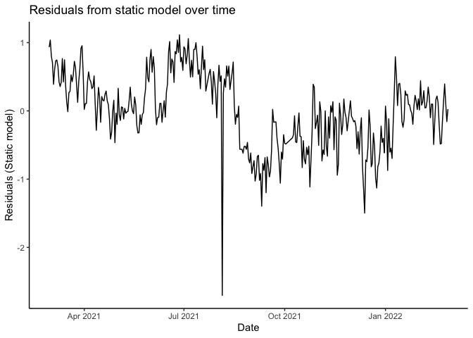
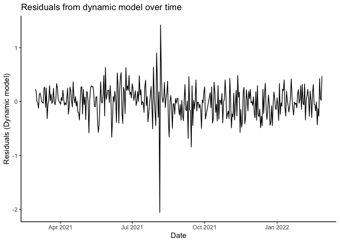
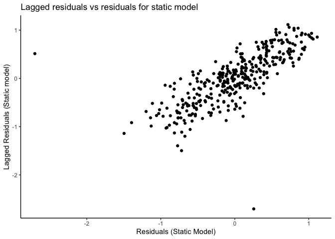
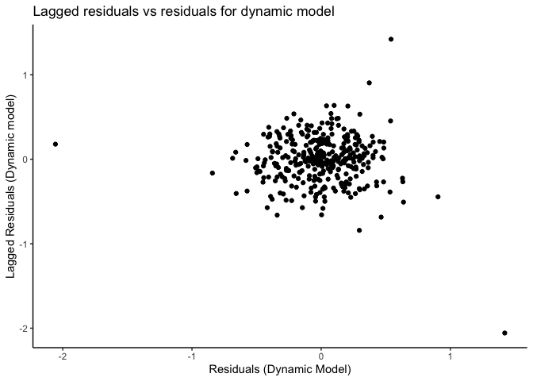

Today we are going to be doing a deep dive into autocorrelation. We'll start by loading up some data and learning how to visually inspect the data for autocorrelation. Then we'll run some formal tests for autocorrelation, including the Durbin-Watson and Bruesch-Godfrey tests. Finally, we'll learn how to use serial correlation robust standard errors. 

# Loading and cleaning data  

We'll be using data from the USGS reported on [water flow data from the McKenzie River](https://waterdata.usgs.gov/nwis/dv?cb_00010=on&cb_00060=on&cb_00300=on&cb_00400=on&format=rdb&site_no=14162500&referred_module=sw&period=&begin_date=2021-02-27&end_date=2022-02-27). I have also posted the data to Canvas. These data have daily averages for a few different statistics over the past year at [this particular water gauge](https://www.google.com/maps/place/44%C2%B007'30.0%22N+122%C2%B028'10.0%22W/@44.1218443,-122.9101473,10.9z). 


```r
# Loading Packages
library(pacman)
p_load(tidyverse, fixest, here, lubridate, skimr, magrittr)

# Reading data 
mckenzie_df_raw = read_table(here("data/mckenzie.txt"), skip = 38)

# Some cleaning, and adding lagged values
mckenzie_df = 
  mckenzie_df_raw |>
  filter(agency_cd == "USGS") |>
  mutate(
    date = ymd(datetime),
    avg_temp = as.numeric(`172061_00010_00003`),
    median_ph = as.numeric(`172057_00400_00008`),
    avg_discharge = as.numeric(`172063_00060_00003`),
    avg_dissolved_oxygen = as.numeric(`232262_00300_00003`)
  ) |>
  select(site_no,date, avg_temp, median_ph, avg_discharge, avg_dissolved_oxygen) |>
  mutate(
    avg_temp_lag = lag(avg_temp),
    avg_discharge_lag = lag(avg_discharge),
    avg_dissolved_oxygen_lag = lag(avg_dissolved_oxygen),
    median_ph_lag = lag(median_ph)
  ) |>
  na.omit()

# Getting a summary of the data
skim(mckenzie_df)
```


Table: Data summary

|                         |            |
|:------------------------|:-----------|
|Name                     |mckenzie_df |
|Number of rows           |358         |
|Number of columns        |10          |
|_______________________  |            |
|Column type frequency:   |            |
|character                |1           |
|Date                     |1           |
|numeric                  |8           |
|________________________ |            |
|Group variables          |None        |


**Variable type: character**

|skim_variable | n_missing| complete_rate| min| max| empty| n_unique| whitespace|
|:-------------|---------:|-------------:|---:|---:|-----:|--------:|----------:|
|site_no       |         0|             1|   8|   8|     0|        1|          0|


**Variable type: Date**

|skim_variable | n_missing| complete_rate|min        |max        |median     | n_unique|
|:-------------|---------:|-------------:|:----------|:----------|:----------|--------:|
|date          |         0|             1|2021-02-28 |2022-02-27 |2021-08-27 |      358|


**Variable type: numeric**

|skim_variable            | n_missing| complete_rate|    mean|      sd|   p0|    p25|    p50|    p75|    p100|hist  |
|:------------------------|---------:|-------------:|-------:|-------:|----:|------:|------:|------:|-------:|:-----|
|avg_temp                 |         0|             1|    9.37|    3.25|  3.3|    6.5|    9.3|   11.6|    15.8|▅▇▇▅▅ |
|median_ph                |         0|             1|    7.53|    0.17|  7.2|    7.4|    7.5|    7.7|     8.0|▂▇▁▃▁ |
|avg_discharge            |         0|             1| 3401.68| 1567.87| 10.8| 2145.0| 3105.0| 3710.0| 10400.0|▂▇▂▁▁ |
|avg_dissolved_oxygen     |         0|             1|   11.24|    0.82|  9.2|   10.7|   11.2|   12.0|    13.0|▁▇▇▇▃ |
|avg_temp_lag             |         0|             1|    9.37|    3.25|  3.3|    6.5|    9.3|   11.6|    15.8|▅▇▇▅▅ |
|avg_discharge_lag        |         0|             1| 3406.71| 1569.21| 10.8| 2145.0| 3110.0| 3717.5| 10400.0|▂▇▂▁▁ |
|avg_dissolved_oxygen_lag |         0|             1|   11.24|    0.82|  9.2|   10.7|   11.2|   12.0|    13.0|▁▇▇▇▃ |
|median_ph_lag            |         0|             1|    7.53|    0.17|  7.2|    7.4|    7.5|    7.7|     7.9|▂▅▇▂▃ |

So we have pulled out a few different variables describing the river flow each day for the past 365 days. Let's say we want to try to predict the effects of various things on water temp.  

# Estimate static and dynamic models  

The first step is going to be estimating some models via OLS. We'll first run a static model, where the outcome today is only dependent on explanatory variables today. Then we'll run a dynamic model, where outcomes or explanatory variables in previous periods can affect outcomes today. 

### Static model   

First, let's fit a model regressing temperature on discharge, dissolved oxygen, and ph. 


```r
# Static model 
mod_s = feols(
  data = mckenzie_df,
  fml = avg_temp ~ avg_discharge + avg_dissolved_oxygen + median_ph,
  panel.id = ~site_no+date,
  vcov = "iid"
)

# Summary of results
etable(mod_s)
```

```
##                                   mod_s
## Dependent Var.:                avg_temp
##                                        
## (Intercept)            23.47*** (3.271)
## avg_discharge         6.23e-5* (2.9e-5)
## avg_dissolved_oxygen -3.438*** (0.0571)
## median_ph             3.229*** (0.3630)
## ____________________ __________________
## S.E. type                           IID
## Observations                        358
## R2                              0.97222
## Adj. R2                         0.97199
## ---
## Signif. codes: 0 '***' 0.001 '**' 0.01 '*' 0.05 '.' 0.1 ' ' 1
```

**Q1:** What does this regression tell you about the relationship between temperature and flow (discharge)?  

### Dynamic model  

Temperature yesterday will also likely be affecting temperatures today, and same with the other variables. Let's fit an ADL(1,1) model here to try to capture that relationship. 


```r
# Fitting a ADL(1,1) model
mod_d = feols(
  data = mckenzie_df,
  fml = avg_temp ~ avg_discharge + avg_discharge_lag +
      avg_dissolved_oxygen + avg_dissolved_oxygen_lag + 
      median_ph + median_ph_lag + 
      avg_temp_lag,
  panel.id = ~site_no+date,
  vcov = "iid"
)

# Summary of results
etable(mod_d)
```

```
##                                         mod_d
## Dependent Var.:                      avg_temp
##                                              
## (Intercept)                    3.990. (2.054)
## avg_discharge             0.0001*** (3.34e-5)
## avg_discharge_lag        -0.0001*** (3.36e-5)
## avg_dissolved_oxygen       -2.053*** (0.1119)
## avg_dissolved_oxygen_lag    1.656*** (0.1260)
## median_ph                   1.967*** (0.3241)
## median_ph_lag              -1.766*** (0.3261)
## avg_temp_lag               0.8881*** (0.0303)
## ________________________ ____________________
## S.E. type                                 IID
## Observations                              358
## R2                                    0.99207
## Adj. R2                               0.99191
## ---
## Signif. codes: 0 '***' 0.001 '**' 0.01 '*' 0.05 '.' 0.1 ' ' 1
```

**Q2**: What is the total effect of ph on water temperature?  

OK now that we have our models estimated, we have to think about whether we trust the results we just looked at, which rely on our OLS assumptions. Here we are specifically concerned about autocorrelation.

# Visual inspection of autocorrelation  

We'll start by plotting the residuals over time to see if there is any evidence of autocorrelation. First, we should add the residuals to the data 

```r
# First let's add the residuals to the data
mckenzie_df %<>%  mutate(
  resid_s = resid(mod_s),
  resid_d = resid(mod_d)
)

# Now lets plot these over time 
# Static model residuals
ggplot(data = mckenzie_df, aes(x = date, y = resid_s)) + 
  geom_line() +
  labs(
    title = "Residuals from static model over time",
    y = "Residuals (Static model)",
    x = "Date"
  ) +
  theme_classic()
```

<!-- -->

```r
# Dynamic model resiudals
ggplot(data = mckenzie_df, aes(x = date, y = resid_d)) + 
  geom_line() +
  labs(
    title = "Residuals from dynamic model over time",
    y = "Residuals (Dynamic model)",
    x = "Date"
  ) +
  theme_classic()
```

<!-- -->

The static model shows pretty clearly that there does appear to be autocorrelation between the resiudals, but the dynamic model actually looks quite a bit better. We can also plot the residuals vs lagged residuals to see if there is any correlation there. 


```r
# First let's add the residuals to the data
mckenzie_df %<>%  mutate(
  resid_s_lag = lag(resid_s),
  resid_d_lag = lag(resid_d)
)

# Now lets plot these over time 
# Static model residuals
ggplot(data = mckenzie_df, aes(x = resid_s, y = resid_s_lag)) + 
  geom_point() +
  labs(
    title = "Lagged residuals vs residuals for static model",
    y = "Lagged Residuals (Static model)",
    x = "Residuals (Static Model)"
  ) +
  theme_classic()
```

<!-- -->

```r
# Dynamic model resiudals
ggplot(data = mckenzie_df, aes(x = resid_d, y = resid_d_lag)) + 
  geom_point() +
  labs(
    title = "Lagged residuals vs residuals for dynamic model",
    y = "Lagged Residuals (Dynamic model)",
    x = "Residuals (Dynamic Model)"
  ) +
  theme_classic()
```

<!-- -->

There is a pretty clear autocorrelation in the static model, but the dynamic model is less clear. These plots are not definitive proof, so let's run some formal tests for autocorrelation. 

# Tests for autocorrelation  

We'll start with the simplest and most common test for autocorrelation, which is technically known as the Durbin-Watson test. 

### Testing for significance of a single lag   

First we'll check for an AR(1) disturbance. The process is as follows...    

1. Run the regression  
2. Save the residuals  
3. Regress residuals on lagged residuals, with no intercept
4. Run a t-test on the coefficient for the lagged residual  

We have already done steps 1 and 2 earlier in the lab, so we'll start with step 3 by regressing the residuals on lagged residuals for both of our models. We'll start with the static model.


```r
# Regressing residuals on lagged residuals 
mod_es = feols(
  data = mckenzie_df, 
  fml = resid_s ~ -1 + resid_s_lag
)

# Checking the results 
etable(mod_es)
```

```
##                             mod_es
## Dependent Var.:            resid_s
##                                   
## resid_s_lag     0.7591*** (0.0342)
## _______________ __________________
## S.E. type                      IID
## Observations                   357
## R2                         0.57993
## Adj. R2                    0.57993
## ---
## Signif. codes: 0 '***' 0.001 '**' 0.01 '*' 0.05 '.' 0.1 ' ' 1
```

Checking the p-value on the coefficient on the lagged residual, we see that we can reject the null hypothesis of no autocorrelation at the 5% significance level. Now let's look at the dynamic model.


```r
# Regressing residuals on lagged residuals
mod_ed = feols(
  data = mckenzie_df, 
  fml = resid_d ~ -1 + resid_d_lag
)

# Now checking the 
etable(mod_ed)
```

```
##                           mod_ed
## Dependent Var.:          resid_d
##                                 
## resid_d_lag     -0.0708 (0.0530)
## _______________ ________________
## S.E. type                    IID
## Observations                 357
## R2                       0.00218
## Adj. R2                  0.00218
## ---
## Signif. codes: 0 '***' 0.001 '**' 0.01 '*' 0.05 '.' 0.1 ' ' 1
```

**Q3**: What is your conclusion for this test?

We have only checked for a single lag, but there could be higher order autocorrelation present. The next test generalizes the Durbin-Watson test to account for this.  

### Testing for more than one lag  

We are going to take on the same process as above, but instead, include more lags and test for joint significance of the coefficients. This time instead of a t-test for the significance of a single coefficient, we have to use the LM test statistic, $LM = n \times R^2_e$, which is distributed $\chi^2_k$, where $k$ is number of lags we are testing. 


```r
# Adding a second lag of the residuals to test
mckenzie_df %<>%
  mutate(
    resid_s_lag2 = lag(resid_s, n = 2),
    resid_d_lag2 = lag(resid_d, n = 2)
  )

# More than one lag 
mod_e2s = feols(
  data = mckenzie_df, 
  fml = resid_s ~ -1 + resid_s_lag + resid_s_lag2
)

# Calculating test stat
s_lm_stat = summary(mod_e2s)$nobs * r2(mod_e2s, type = "r2") |> unname()

# Calculating p-value 
(s_p_value = 1 - pchisq(s_lm_stat, df = 2))
```

```
## [1] 0
```

So we have strong evidence of autocorrelation, the p-value is essentially 0, which means we can reject the null hypothesis that the coefficients on both lagged residual terms are zero. 


```r
# More than one lag 
mod_e2d = feols(
  data = mckenzie_df, 
  fml = resid_d ~ -1 + resid_d_lag + resid_d_lag2
)

# Calculating test stat
d_lm_stat = summary(mod_e2d)$nobs * r2(mod_e2d, type = "r2") |> unname()

# Calculating p-value 
(d_p_value = 1 - pchisq(d_lm_stat, df = 2))
```

```
## [1] 0.4363966
```

**Q4**: What is your conclusion from this test?   


### Breusch-Godfrey Test  

If you have a model with both a lagged outcome variable and autocorrelation, then you'll have biased estimates of $\beta$, but this also means the residuals are biased estimates of the error terms! So we can't just use the residuals to test for autocorrelation anymore. The BG test instead regresses the residuals on lagged residuals **and** the explanatory variables from the original model. 

The main difference here is that we regress the residuals from the original model on the lagged residuals **and** explanatory variables. We'll also use an F-Test instead of LM. F-tests are all about understanding the *joint explanatory power* of a set of regressors. It is feasible that some regressors work better than others when explaining an outcome variable, and this test helps us decide which combinations of variables are "best". Recall the formula for the F-stat:

$$
F_{q,n-p} = \frac{SSE_r - SSE_u/q}{SSE_u/(n-p)}
$$

 - $SSR_r$ is the sum of squared residuals from the **restricted model**, ie the model with less covariates (it is called restricted because you have forced the coefficients on the covariates you leave out to 0).
 - $SSR_u$ is from the unrestricted model
 - $q$ is the number of restrictions This is just a normalization
 - $n-p$ is the number of observations - the number of parameters in the restricted model

Remember: the null hypothesis for the F-test is:

$H_0: \beta_0=\beta_1=...=\beta_q=0$

Alternative Hypothesis: Not the null hypothesis, but what does that mean? At least one of $\{\beta_0,\beta_1,..., \beta_q\} \neq 0$

So in words: our null hypothesis is that the "restricted model" is the true model, and the alternative hypothesis is that it is not.

Let's look at these piece by piece.

 - $SSR_r-SSR_u$: Basically tells us how much we benefit (or lose) from using the restricted model over the unrestricted model. 

 - We divide this by the (normalized) unrestricted model. So basically the ratio you are taking is the ratio of the loss of fit from the restricted model to the benefit from the unrestricted model. 

 - If the numerator (the benefit) is not very large relative to the denominator, the F-stat will be small (and we are *less likely* to reject the null in favor of the alternative). 

 - If on the other hand the numerator is large relative to the denominator, the F-stat will be large as well. We would be *more likely* to reject the null.


The `lmtest` package has a nice function, `waldtest()` that can run this test for you. Note that this won't work if you run the regression using `fixest`. 


```r
p_load(lmtest)

# Regressing resids on explanatory variables and lagged resids
mod_bg = lm(
  data = mckenzie_df,
  formula = resid_d ~ avg_discharge + avg_discharge_lag +
      avg_dissolved_oxygen + avg_dissolved_oxygen_lag + 
      median_ph + median_ph_lag + avg_temp_lag +
      resid_d_lag + resid_d_lag2 
)

# Running the test, where we are restricting the lagged residuals
waldtest(mod_bg, c("resid_d_lag", "resid_d_lag2"))
```

```
## Wald test
## 
## Model 1: resid_d ~ avg_discharge + avg_discharge_lag + avg_dissolved_oxygen + 
##     avg_dissolved_oxygen_lag + median_ph + median_ph_lag + avg_temp_lag + 
##     resid_d_lag + resid_d_lag2
## Model 2: resid_d ~ avg_discharge + avg_discharge_lag + avg_dissolved_oxygen + 
##     avg_dissolved_oxygen_lag + median_ph + median_ph_lag + avg_temp_lag
##   Res.Df Df     F Pr(>F)
## 1    346                
## 2    348 -2 2.019 0.1343
```

Thus, we fail to reject the null hypothesis of no-autocorrelation at the 5% significance level.

# Living with autocorrelation  

Now that we know that autocorrelation is present in the data, we have a few options on how to deal with it. 

**Q**: What problems does the presence of autocorrelation cause?  

The first way to deal with autocorrelation, which we've done a bit of today, is fixing misspecification. Comparing the dynamic model to the static model is a good example of this, where the static model seemed to have much stronger autocorrelation than the dynamic model. But, there are infinitely many ways to write down a model and we can never be sure we have the right one.  

### Autocorrelation-robust standard errors  

The `fixest` package again has a very easy solution here. We can simply tell it to calculate the Newey-West standard errors with `vcov = "NW"`, which are robust to autocorrelation, and it will give us the correct standard errors in the presence of autocorrelation!


```r
# Serial autocorrelation robust standard errors
etable(mod_s, vcov = "NW")
```

```
##                                   mod_s
## Dependent Var.:                avg_temp
##                                        
## (Intercept)            23.47*** (5.520)
## avg_discharge         6.23e-5 (4.53e-5)
## avg_dissolved_oxygen -3.438*** (0.0954)
## median_ph             3.229*** (0.6295)
## ____________________ __________________
## S.E. type              Newey-West (L=4)
## Observations                        358
## R2                              0.97222
## Adj. R2                         0.97199
## ---
## Signif. codes: 0 '***' 0.001 '**' 0.01 '*' 0.05 '.' 0.1 ' ' 1
```

```r
etable(mod_d, vcov = "NW")
```

```
##                                       mod_d
## Dependent Var.:                    avg_temp
##                                            
## (Intercept)                  3.990* (1.869)
## avg_discharge              0.0001 (9.37e-5)
## avg_discharge_lag         -0.0001 (9.23e-5)
## avg_dissolved_oxygen     -2.053*** (0.3531)
## avg_dissolved_oxygen_lag  1.656*** (0.3808)
## median_ph                 1.967*** (0.4519)
## median_ph_lag            -1.766*** (0.3955)
## avg_temp_lag             0.8881*** (0.0315)
## ________________________ __________________
## S.E. type                  Newey-West (L=4)
## Observations                            358
## R2                                  0.99207
## Adj. R2                             0.99191
## ---
## Signif. codes: 0 '***' 0.001 '**' 0.01 '*' 0.05 '.' 0.1 ' ' 1
```


### Feasible Generalized Least Squares  

This is another way to deal with autocorrelation, but we won't have time to discuss it here. Come see me in office hours if you want to talk more about this!  


