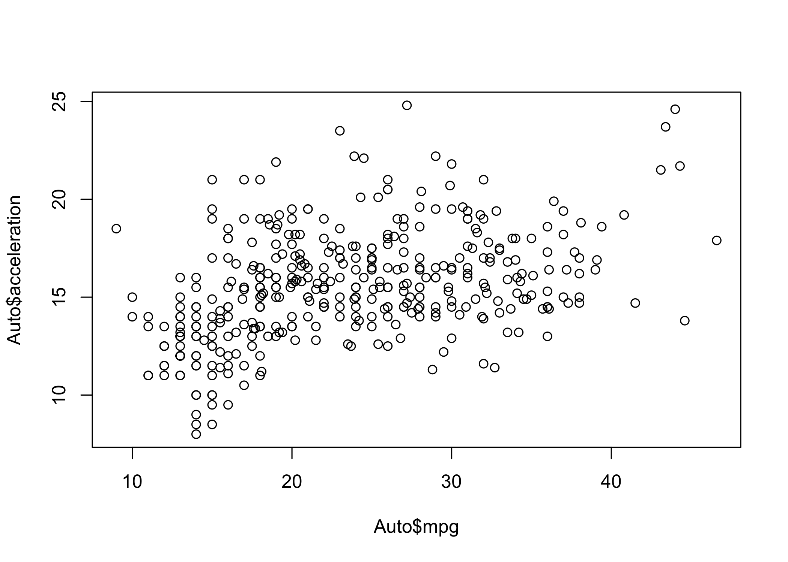
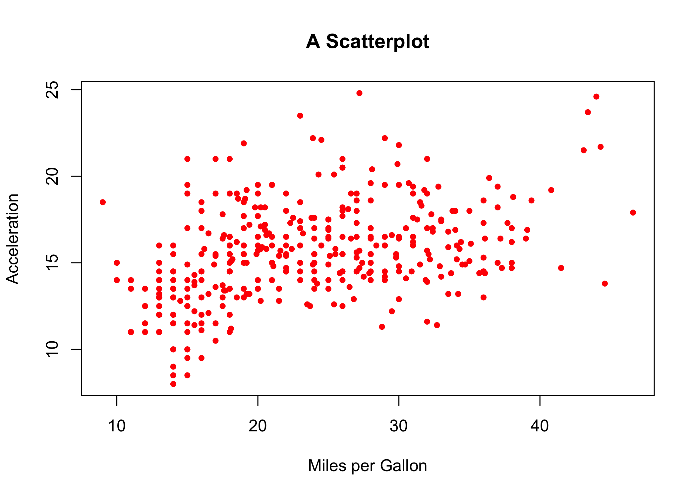
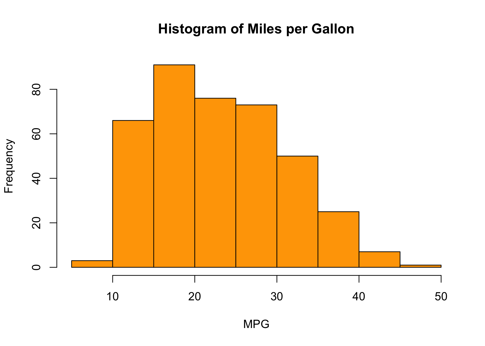
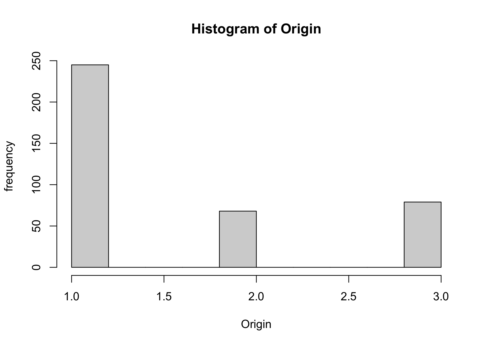

*Thanks to Connor Lennon for creating the basis of these notes.*

# Installing R and RStudio  

First I want to make sure you all have `R` and RStudio running on your machines. The computers in this computer lab already have them installed, but it will be useful for you to have it running on your own computer as well.

  - **R**: https://cloud.r-project.org/   
  - **RStudio**: https://www.rstudio.com/products/rstudio/download/preview/ 

There is a subtle difference`R` and RStudio: `R` is a coding language and environment used for statistical computing, while RStudio is an application that you can use to run `R` code. Thus, you can write and execute `R` code directly from your command line or any number of applications, RStudio just happens to be the best of these applications (at least for the purposes of this class).  

We will be writing what are called *scripts*. These are text files that can be sent to the `R` console to be run.

- To run a line of code from a script hit cmd+return (control+enter if on PC). Alternatively, you can select all of the code you want to run and then hit cmd+return (or cmd+option+R to run the entire script)
- To save the script, cmd+s.
- There are lots of useful keyboard shortcuts, hit option+shift+K to see them  
- R uses *functions*, which we apply to *objects*. More on this shortly, but if you aren't sure what a function does, or how it works, you can use `?` before the function to get the documentation.  


```r
?mean
# Or, equivalently
help(mean)
```

As a note, these grey boxes will be where I am typing my code for you to reference, these function equivalently to scripts.

There are a ton of different types of objects (numeric (numbers), character (letters) and logical (true false statements) are the most common types), and not all functions will work on all objects. Let's talk a bit about objects.

# All things are objects

An object is an assignment between a name and a value. You assign values to names using `<-` or `=`. The first assignment symbol consists of a `<` next to a dash `-` to make it look like an arrow. 

If we want to make an object name `a` refer to the number `2`, we can do that by:


```r
# Creating our first object
a <- 2
a
```

```
## [1] 2
```

```r
# This does the same thing 
a = 2
a
```

```
## [1] 2
```

Note: The `#` comments out code meaning `R` will not evaluate the code. This is a convenient way to write yourself notes as you're coding. It is a **very** good habit to always comment your code, even if it seems obvious what you are doing. Future you will be the main benefactor of well commented code).

Once you have an object, you can use it as if it was whatever value the object holds.   


```r
# Assign the value of 3 to the name b
b <- 3
# Assign the value of b (3) plus the value of a (2), to a new name, c.
c <- a + b
#display c
c
```

```
## [1] 5
```

When you wrap parentheses around an assignment, R will both assign the value to the name and print out the value that you've assigned.


```r
#let's print two lines. Parentheses will print this
(d <- c * 3)
```

```
## [1] 15
```

```r
# We can also combine functions with objects and values
d + 3 - 1 + c
```

```
## [1] 22
```

Objects can also contain more than one value. What do you think the object 1:10 does?


```r
(tmp <- 1:10)
```

```
##  [1]  1  2  3  4  5  6  7  8  9 10
```

This displays a sequence of integers (whole numbers), going from the first value to the last one, ie, 9:10 will return 9 10.

One common way (illustrated above) to store multiple values is via a `vector`.


# Functions

Functions are operations you can apply to objects. Many are quite simple, but even the simple ones can be combined in many ways to do very powerful things.  

Examples: `head`, `tail`, `mean`, `median`, `sd`, `summary`, `min`, `max`

These particular functions are good at summarizing data in a variety of ways. Let's see how they work


```r
# Print the first few objects in 'tmp'
head(tmp)
```

```
## [1] 1 2 3 4 5 6
```

```r
# Print the first 3 objects in 'tmp'
head(tmp, 3)
```

```
## [1] 1 2 3
```

```r
# Print the last few objects in 'tmp'
tail(tmp)
```

```
## [1]  5  6  7  8  9 10
```


```r
# Mean of our vector tmp
mean(tmp)
```

```
## [1] 5.5
```

```r
# Median of our vector
median(tmp)
```

```
## [1] 5.5
```

```r
# Standard deviation of our vector
sd(tmp)
```

```
## [1] 3.02765
```

```r
# Print a summary of our object. This can work on many object types and is useful to get an overview
summary(tmp)
```

```
##    Min. 1st Qu.  Median    Mean 3rd Qu.    Max. 
##    1.00    3.25    5.50    5.50    7.75   10.00
```

```r
# Print minimum of the vector
min(tmp)
```

```
## [1] 1
```

```r
# Print max of a vector
max(tmp)
```

```
## [1] 10
```

### Mathematical operators

We can also use `R` to do anything you could do in a calculator, that is, multiply, divide, and so forth. Most of these are self explanatory


```r
#add
11 + 2
```

```
## [1] 13
```

```r
#subtract
11 - 2
```

```
## [1] 9
```

```r
#multiply
11 * 2
```

```
## [1] 22
```

```r
#divide
11 / 2
```

```
## [1] 5.5
```

```r
#Find remainder (this is surprisingly useful)
(11 %% 2)
```

```
## [1] 1
```

```r
#Find integer division, ie, how many times does 2 fit into 11 as a whole number
11 %/% 2
```

```
## [1] 5
```

```r
#Power
11 ^ 2
```

```
## [1] 121
```

Functions typically output objects, e.g., `c()` creates vectors of values for individual objects' values. If you want to save the output of a function, you can assign it to an object.   


```r
vec_a <- c(1, 5, 8, 20)
vec_a
```

```
## [1]  1  5  8 20
```

You can also apply mathematical operators to vectors.


```r
vec_a * 2
```

```
## [1]  2 10 16 40
```

```r
vec_a ^ 2
```

```
## [1]   1  25  64 400
```

```r
vec_a - vec_a
```

```
## [1] 0 0 0 0
```

Finally, keep track of missing values (`NA`) and infinity (`Inf`)!


```r
# Division by NA
vec_a / NA
```

```
## [1] NA NA NA NA
```

```r
# Division by zero. This creates a special value in R called 'inf'
vec_a / 0
```

```
## [1] Inf Inf Inf Inf
```


So far, you've seen number objects (which can be `numeric` or `integer`). We can see what kind of class an object is by using the `class()` function.


```r
class(a)
```

```
## [1] "numeric"
```

```r
class(tmp)
```

```
## [1] "integer"
```

```r
class(vec_a)
```

```
## [1] "numeric"
```

Another common class of objects is `character`: In order to tell `R` that you want something to be a character object, you must surround it with `""` or `''`.  


```r
# Let's create a character object 
(some_text <- "I have a birthday, but it is not today.")
```

```
## [1] "I have a birthday, but it is not today."
```

```r
class(some_text)
```

```
## [1] "character"
```

Lastly, we have `logical` objects. 

Logical objects are essentially anything you could classify as a true/false statement, like, the sky is purple = `FALSE`. These generally use the characters less than (`<`), greater than (`>`), or is equivalent (`==`).  


```r
# Some comparison
2 < 3
```

```
## [1] TRUE
```

```r
2 > 3
```

```
## [1] FALSE
```

```r
2 == 3
```

```
## [1] FALSE
```

```r
TRUE == TRUE
```

```
## [1] TRUE
```

```r
class(TRUE)
```

```
## [1] "logical"
```

We can also do this with vectors. This will compare each element in the vector to check your provided condition.


```r
c(1,2,3,4,5) < c(2,0,1,2,3)
```

```
## [1]  TRUE FALSE FALSE FALSE FALSE
```

There are also special operators for "and" (`&`) and "or" (`|`).


```r
# AND
TRUE & FALSE
```

```
## [1] FALSE
```

```r
# OR
TRUE | FALSE
```

```
## [1] TRUE
```

### Data Structures  

We can combine these classes of objects to create structures. We've already used the most common example of a structure, vectors.  

Be careful though. Vectors only hold values that have the same class, for example


```r
# Let's make a bad vector
bad <- c(tmp, "red", "dinosaurs", NULL)

# and print the last 4 values
head(bad, 4)
```

```
## [1] "1" "2" "3" "4"
```

```r
head(tmp, 4)
```

```
## [1] 1 2 3 4
```

How do the values from `bad` differ from those of `tmp`? 


```r
class(bad)
```

```
## [1] "character"
```

Why is it a `character` now? Well, `R` is trying to help us. By adding some words to the end of the vector, `R` will automatically transform the entire vector to a character class. We can however, store multiple types of values by using special data types, such as lists.

For example, a list can store objects of any type as its elements (even vectors!)


```r
# Making a list with different classes
ex_ls <- list(1,"some text",TRUE, tmp)

# Values maintain their original class
class(ex_ls[[1]])
```

```
## [1] "numeric"
```

```r
class(ex_ls[[2]])
```

```
## [1] "character"
```

Another very important structure is the data frame. We can create a data frame with the `data.frame()` function, passing it three *arguments* that are *vectors.* Let's see how that works:


```r
our_df <- data.frame(
  v1 = 1:4,
  v2 = c(T, T, F, T),
  v3 = c("a", "b", "c", "d")
)
our_df
```

```
##   v1    v2 v3
## 1  1  TRUE  a
## 2  2  TRUE  b
## 3  3 FALSE  c
## 4  4  TRUE  d
```

You can think about data frames (`data.frame`) like a spreadsheet, each column as a new variable, and each row has a new observation. We'll generally read data into `R` as a data frame.

There are many other structures besides the ones I have talked about here, but I'll introduce them as we go along.  


# Load Packages

Base R (what comes installed on your computer) is an incredibly powerful programming language, but one of the best features of `R` are its packages, which are remotely stored functions or data written by anybody. You could even write a package if you wanted! Think of them like "add-ons" to `R`. This open source nature allows `R` to be extremely flexible. For now, we will load the `pacman`, `ISLR`, and `ggplot2`. `pacman` has various package management tools, `ISLR` has some data sets that we can use, and `ggplot2` has very nice plotting/data visualization tools. 

Let's start by loading packages. Uncomment the `install.packages` function to get the `pacman` package to install. If you already have some of these packages, feel free to delete lines. The `install.packages` function can take a vector of package names, as characters, to install all of the above.  


```r
# Installing pacman
install.packages(
  "pacman", 
  dependencies = T, # also install other packages used by pacman
  repos = "http://cran.us.r-project.org" # where to go to get the packages
)
```

```
## 
## The downloaded binary packages are in
## 	/var/folders/ld/0_10r7w56sl5sv4cyqxn23zc0000gn/T//RtmpTJ0DSu/downloaded_packages
```

```r
# One a package is installed, we have to load it
library(pacman)

# p_load is a function from pacman that allows you to flexibly install and load 
# packages with simpler code than base R
p_load(ISLR, ggplot2)
```

You can also do all of this in base R, but it's not as efficient.


```r
# The following code does the same thing. Not as good. 
# More packages you have, the more convenient pacman becomes.
install.packages(
  c("ISLR","ggplot2"),
  dependencies = T, 
  repos="http://cran.us.r-project.org"
)
library(ISLR)
library(ggplot2)
```

Once you have a package installed, you do not need to install it ever again (except if a new version of the package is released and you want to update it). However, every time you start a new session in `R` you will need to load all of the packages you want to use.  


# More about data frames

We installed and loaded `ISLR` because it has a nice dataset for learning about data frames: `Auto`. Let's spend some time familiarizing ourselves with the dataset. We can use many of the familiar tools we had before, namely `head()`, `tail()`, and `summary()`.

If we want to look at a specific column of a data frame, we can do this by writing `dataframe$columnName`


```r
# Getting a summary is always nice before doing anything 
summary(Auto)
```

```
##       mpg          cylinders      displacement     horsepower        weight    
##  Min.   : 9.00   Min.   :3.000   Min.   : 68.0   Min.   : 46.0   Min.   :1613  
##  1st Qu.:17.00   1st Qu.:4.000   1st Qu.:105.0   1st Qu.: 75.0   1st Qu.:2225  
##  Median :22.75   Median :4.000   Median :151.0   Median : 93.5   Median :2804  
##  Mean   :23.45   Mean   :5.472   Mean   :194.4   Mean   :104.5   Mean   :2978  
##  3rd Qu.:29.00   3rd Qu.:8.000   3rd Qu.:275.8   3rd Qu.:126.0   3rd Qu.:3615  
##  Max.   :46.60   Max.   :8.000   Max.   :455.0   Max.   :230.0   Max.   :5140  
##                                                                                
##   acceleration        year           origin                      name    
##  Min.   : 8.00   Min.   :70.00   Min.   :1.000   amc matador       :  5  
##  1st Qu.:13.78   1st Qu.:73.00   1st Qu.:1.000   ford pinto        :  5  
##  Median :15.50   Median :76.00   Median :1.000   toyota corolla    :  5  
##  Mean   :15.54   Mean   :75.98   Mean   :1.577   amc gremlin       :  4  
##  3rd Qu.:17.02   3rd Qu.:79.00   3rd Qu.:2.000   amc hornet        :  4  
##  Max.   :24.80   Max.   :82.00   Max.   :3.000   chevrolet chevette:  4  
##                                                  (Other)           :365
```

```r
# Let's call a specific column
Auto$cylinders
```

```
##   [1] 8 8 8 8 8 8 8 8 8 8 8 8 8 8 4 6 6 6 4 4 4 4 4 4 6 8 8 8 8 4 4 4 6 6 6 6 6
##  [38] 8 8 8 8 8 8 8 6 4 6 6 4 4 4 4 4 4 4 4 4 4 4 4 4 8 8 8 8 8 8 8 8 8 3 8 8 8
##  [75] 8 4 4 4 4 4 4 4 4 4 8 8 8 8 8 8 8 8 8 8 8 8 6 6 6 6 6 4 8 8 8 8 6 4 4 4 3
## [112] 4 6 4 8 8 4 4 4 4 8 4 6 8 6 6 6 4 4 4 4 6 6 6 8 8 8 8 8 4 4 4 4 4 4 4 4 4
## [149] 4 4 6 6 6 6 8 8 8 8 6 6 6 6 6 8 8 4 4 6 4 4 4 4 6 4 6 4 4 4 4 4 4 4 4 4 4
## [186] 8 8 8 8 6 6 6 6 4 4 4 4 6 6 6 6 4 4 4 4 4 8 4 6 6 8 8 8 8 4 4 4 4 4 8 8 8
## [223] 8 6 6 6 6 8 8 8 8 4 4 4 4 4 4 4 4 6 4 3 4 4 4 4 4 8 8 8 6 6 6 4 6 6 6 6 6
## [260] 6 8 6 8 8 4 4 4 4 4 4 4 4 5 6 4 6 4 4 6 6 4 6 6 8 8 8 8 8 8 8 8 4 4 4 4 5
## [297] 8 4 8 4 4 4 4 4 6 6 4 4 4 4 4 4 4 4 6 4 4 4 4 4 4 4 4 4 4 5 4 4 4 4 6 3 4
## [334] 4 4 4 4 6 4 4 4 4 4 4 4 4 4 4 4 4 4 4 4 4 4 6 6 6 6 8 6 6 4 4 4 4 4 4 4 4
## [371] 4 4 4 4 4 4 4 4 4 4 6 6 4 6 4 4 4 4 4 4 4 4
```

```r
#Look at the first few rows of our data frame
head(Auto)
```

```
##   mpg cylinders displacement horsepower weight acceleration year origin
## 1  18         8          307        130   3504         12.0   70      1
## 2  15         8          350        165   3693         11.5   70      1
## 3  18         8          318        150   3436         11.0   70      1
## 4  16         8          304        150   3433         12.0   70      1
## 5  17         8          302        140   3449         10.5   70      1
## 6  15         8          429        198   4341         10.0   70      1
##                        name
## 1 chevrolet chevelle malibu
## 2         buick skylark 320
## 3        plymouth satellite
## 4             amc rebel sst
## 5               ford torino
## 6          ford galaxie 500
```

```r
# Look at the last few rows of our data frame
tail(Auto)
```

```
##     mpg cylinders displacement horsepower weight acceleration year origin
## 392  27         4          151         90   2950         17.3   82      1
## 393  27         4          140         86   2790         15.6   82      1
## 394  44         4           97         52   2130         24.6   82      2
## 395  32         4          135         84   2295         11.6   82      1
## 396  28         4          120         79   2625         18.6   82      1
## 397  31         4          119         82   2720         19.4   82      1
##                 name
## 392 chevrolet camaro
## 393  ford mustang gl
## 394        vw pickup
## 395    dodge rampage
## 396      ford ranger
## 397       chevy s-10
```

### Indexing

We can also call columns and rows by their numeric index. This is a numerical value that `R` holds onto as a reference point. As a note for computer-savvy readers: `R` begins indexing at 1. Let's see what this looks like:


```r
# Here's our first column
Auto$cylinders
```

```
##   [1] 8 8 8 8 8 8 8 8 8 8 8 8 8 8 4 6 6 6 4 4 4 4 4 4 6 8 8 8 8 4 4 4 6 6 6 6 6
##  [38] 8 8 8 8 8 8 8 6 4 6 6 4 4 4 4 4 4 4 4 4 4 4 4 4 8 8 8 8 8 8 8 8 8 3 8 8 8
##  [75] 8 4 4 4 4 4 4 4 4 4 8 8 8 8 8 8 8 8 8 8 8 8 6 6 6 6 6 4 8 8 8 8 6 4 4 4 3
## [112] 4 6 4 8 8 4 4 4 4 8 4 6 8 6 6 6 4 4 4 4 6 6 6 8 8 8 8 8 4 4 4 4 4 4 4 4 4
## [149] 4 4 6 6 6 6 8 8 8 8 6 6 6 6 6 8 8 4 4 6 4 4 4 4 6 4 6 4 4 4 4 4 4 4 4 4 4
## [186] 8 8 8 8 6 6 6 6 4 4 4 4 6 6 6 6 4 4 4 4 4 8 4 6 6 8 8 8 8 4 4 4 4 4 8 8 8
## [223] 8 6 6 6 6 8 8 8 8 4 4 4 4 4 4 4 4 6 4 3 4 4 4 4 4 8 8 8 6 6 6 4 6 6 6 6 6
## [260] 6 8 6 8 8 4 4 4 4 4 4 4 4 5 6 4 6 4 4 6 6 4 6 6 8 8 8 8 8 8 8 8 4 4 4 4 5
## [297] 8 4 8 4 4 4 4 4 6 6 4 4 4 4 4 4 4 4 6 4 4 4 4 4 4 4 4 4 4 5 4 4 4 4 6 3 4
## [334] 4 4 4 4 6 4 4 4 4 4 4 4 4 4 4 4 4 4 4 4 4 4 6 6 6 6 8 6 6 4 4 4 4 4 4 4 4
## [371] 4 4 4 4 4 4 4 4 4 4 6 6 4 6 4 4 4 4 4 4 4 4
```

```r
# If we want the first element of that column, we can do that this way:
Auto$cylinders[1]
```

```
## [1] 8
```

```r
# We can also grab elements, say 1-10 in an array:
Auto$cylinders[1:10]
```

```
##  [1] 8 8 8 8 8 8 8 8 8 8
```

```r
# For data frames, we can grab from specific rows and columns
Auto[2,1] # Note index order is df[rows,cols]
```

```
## [1] 15
```

```r
# We can also grab multiple rows/columns
Auto[2:3,c(1,8)]
```

```
##   mpg origin
## 2  15      1
## 3  18      1
```

We can also use a few new summary functions to get some basic information out of our data frame:


```r
#Number of rows
nrow(Auto)
```

```
## [1] 392
```

```r
#Number of columns
ncol(Auto)
```

```
## [1] 9
```

```r
#Dimensions of the DF
dim(Auto)
```

```
## [1] 392   9
```


# Plotting

One of the most useful things in R is the myriad of ways it can visualize data in an appealing way. Let's dive in. The `plot(x,y)` function will produce a scatter plot.


```r
# plot(x,y)
plot(Auto$mpg, Auto$acceleration)
```

<!-- -->

But that is a pretty lame plot, lets make it a bit better


```r
# First lets figure out what acceleration is: 
?Auto

#Now lets make our graph look a bit better
plot(
  Auto$mpg, 
  Auto$acceleration, 
  xlab = "Miles per Gallon", # x label
  ylab = "Acceleration", # y label
  main = "A Scatterplot", # title
  col = "red", # sets color
  pch = 20 # dot shape 
)
```

<!-- -->

We can also plot a histogram


```r
hist(
  Auto$mpg,
  main= "Histogram of Miles per Gallon", 
  xlab= "MPG", 
  ylab="Frequency", 
  col = "orange"
)
```

<!-- -->

These plots are coming from Base R, but there are lots of packages that make plotting in `R` easy and powerful that we will get into during subsequent labs.  


# Regression

What you guys came here for! Lots of regression.

We have a new function, `lm()`, and a new object type, called a `formula`. If we want to run a regression: $Y = \beta*X + \varepsilon$ we have to pass the `lm` function something it can use to know what to do. We do this with the `y ~ x1 + x2...` format. 
  

```r
# Create an object w regression. lm for "linear model"
new_reg = lm(mpg ~ weight, data = Auto)

# And we can use the summary object to see the results
summary(new_reg)
```

```
## 
## Call:
## lm(formula = mpg ~ weight, data = Auto)
## 
## Residuals:
##      Min       1Q   Median       3Q      Max 
## -11.9736  -2.7556  -0.3358   2.1379  16.5194 
## 
## Coefficients:
##              Estimate Std. Error t value Pr(>|t|)    
## (Intercept) 46.216524   0.798673   57.87   <2e-16 ***
## weight      -0.007647   0.000258  -29.64   <2e-16 ***
## ---
## Signif. codes:  0 '***' 0.001 '**' 0.01 '*' 0.05 '.' 0.1 ' ' 1
## 
## Residual standard error: 4.333 on 390 degrees of freedom
## Multiple R-squared:  0.6926,	Adjusted R-squared:  0.6918 
## F-statistic: 878.8 on 1 and 390 DF,  p-value: < 2.2e-16
```
  
Also, we can run regressions without defining a dataset.


```r
# Regressing without specifying data set
lm(Auto$mpg ~ Auto$weight) |> summary()
```

```
## 
## Call:
## lm(formula = Auto$mpg ~ Auto$weight)
## 
## Residuals:
##      Min       1Q   Median       3Q      Max 
## -11.9736  -2.7556  -0.3358   2.1379  16.5194 
## 
## Coefficients:
##              Estimate Std. Error t value Pr(>|t|)    
## (Intercept) 46.216524   0.798673   57.87   <2e-16 ***
## Auto$weight -0.007647   0.000258  -29.64   <2e-16 ***
## ---
## Signif. codes:  0 '***' 0.001 '**' 0.01 '*' 0.05 '.' 0.1 ' ' 1
## 
## Residual standard error: 4.333 on 390 degrees of freedom
## Multiple R-squared:  0.6926,	Adjusted R-squared:  0.6918 
## F-statistic: 878.8 on 1 and 390 DF,  p-value: < 2.2e-16
```

On your own, interpret these coefficients? What do these mean?

As a quick aside, I snuck in a super useful operator, `|>`, called a "pipe." These pass intermediate objects into the subsequent function. I use these constantly in my code because they make the code more readable.  


```r
# With pipe
lm(Auto$mpg ~ Auto$weight) |> summary()
```

```
## 
## Call:
## lm(formula = Auto$mpg ~ Auto$weight)
## 
## Residuals:
##      Min       1Q   Median       3Q      Max 
## -11.9736  -2.7556  -0.3358   2.1379  16.5194 
## 
## Coefficients:
##              Estimate Std. Error t value Pr(>|t|)    
## (Intercept) 46.216524   0.798673   57.87   <2e-16 ***
## Auto$weight -0.007647   0.000258  -29.64   <2e-16 ***
## ---
## Signif. codes:  0 '***' 0.001 '**' 0.01 '*' 0.05 '.' 0.1 ' ' 1
## 
## Residual standard error: 4.333 on 390 degrees of freedom
## Multiple R-squared:  0.6926,	Adjusted R-squared:  0.6918 
## F-statistic: 878.8 on 1 and 390 DF,  p-value: < 2.2e-16
```

```r
# Without pipe
summary(lm(Auto$mpg ~ Auto$weight))
```

```
## 
## Call:
## lm(formula = Auto$mpg ~ Auto$weight)
## 
## Residuals:
##      Min       1Q   Median       3Q      Max 
## -11.9736  -2.7556  -0.3358   2.1379  16.5194 
## 
## Coefficients:
##              Estimate Std. Error t value Pr(>|t|)    
## (Intercept) 46.216524   0.798673   57.87   <2e-16 ***
## Auto$weight -0.007647   0.000258  -29.64   <2e-16 ***
## ---
## Signif. codes:  0 '***' 0.001 '**' 0.01 '*' 0.05 '.' 0.1 ' ' 1
## 
## Residual standard error: 4.333 on 390 degrees of freedom
## Multiple R-squared:  0.6926,	Adjusted R-squared:  0.6918 
## F-statistic: 878.8 on 1 and 390 DF,  p-value: < 2.2e-16
```

```r
# These are equivalent, but which is easier to read?
```

This is a simple example, but imagine how hard it would be to read 10 chained-together functions if they were written without pipes!

Let's do another regression. This time, looking at the effect of origin on miles per gallon.


```r
# Regression of origin on MPG
origin_reg <- lm(mpg ~ origin, data = Auto)
summary(origin_reg)
```

```
## 
## Call:
## lm(formula = mpg ~ origin, data = Auto)
## 
## Residuals:
##      Min       1Q   Median       3Q      Max 
## -13.2416  -5.2533  -0.7651   3.8967  18.7115 
## 
## Coefficients:
##             Estimate Std. Error t value Pr(>|t|)    
## (Intercept)  14.8120     0.7164   20.68   <2e-16 ***
## origin        5.4765     0.4048   13.53   <2e-16 ***
## ---
## Signif. codes:  0 '***' 0.001 '**' 0.01 '*' 0.05 '.' 0.1 ' ' 1
## 
## Residual standard error: 6.447 on 390 degrees of freedom
## Multiple R-squared:  0.3195,	Adjusted R-squared:  0.3177 
## F-statistic: 183.1 on 1 and 390 DF,  p-value: < 2.2e-16
```
  
Notice that `origin` variable is coded as numeric, but it really is a categorical variable (1 = American, 2 = European, 3 = Japanese). `R` doesn't know this, so it's treating it as if '3' is 3 times as origin-y as '1'. We don't want that.


```r
# R is treating origin as a...
class(Auto$origin)
```

```
## [1] "numeric"
```

```r
#To visualize...
hist(
  Auto$origin,
  main= "Histogram of Origin",
  xlab= "Origin", 
  ylab="frequency"
)
```

<!-- -->
  
There's a way to fix this, by redefining `Auto$origin` using the `as.character()` function.


```r
origin_reg <- lm(mpg ~ as.character(origin), data = Auto)
summary(origin_reg)
```

```
## 
## Call:
## lm(formula = mpg ~ as.character(origin), data = Auto)
## 
## Residuals:
##     Min      1Q  Median      3Q     Max 
## -12.451  -5.034  -1.034   3.649  18.966 
## 
## Coefficients:
##                       Estimate Std. Error t value Pr(>|t|)    
## (Intercept)            20.0335     0.4086  49.025   <2e-16 ***
## as.character(origin)2   7.5695     0.8767   8.634   <2e-16 ***
## as.character(origin)3  10.4172     0.8276  12.588   <2e-16 ***
## ---
## Signif. codes:  0 '***' 0.001 '**' 0.01 '*' 0.05 '.' 0.1 ' ' 1
## 
## Residual standard error: 6.396 on 389 degrees of freedom
## Multiple R-squared:  0.3318,	Adjusted R-squared:  0.3284 
## F-statistic:  96.6 on 2 and 389 DF,  p-value: < 2.2e-16
```

When `lm()` sees a character value, it will automatically treat that variable as a dummy variable. Now, origin is equal to "1" rather than 1.

As an aside, and to test your memory: what is the interpretation of the intercept here?

If we wanted, we could also remove the intercept by adding a `-1` to the regression formula. This might give you a hint to the question above:

```r
#remove the intercept
origin_reg_no_int <- lm(mpg ~ as.character(origin)-1, data = Auto)
summary(origin_reg_no_int)
```

```
## 
## Call:
## lm(formula = mpg ~ as.character(origin) - 1, data = Auto)
## 
## Residuals:
##     Min      1Q  Median      3Q     Max 
## -12.451  -5.034  -1.034   3.649  18.966 
## 
## Coefficients:
##                       Estimate Std. Error t value Pr(>|t|)    
## as.character(origin)1  20.0335     0.4086   49.02   <2e-16 ***
## as.character(origin)2  27.6029     0.7757   35.59   <2e-16 ***
## as.character(origin)3  30.4506     0.7196   42.31   <2e-16 ***
## ---
## Signif. codes:  0 '***' 0.001 '**' 0.01 '*' 0.05 '.' 0.1 ' ' 1
## 
## Residual standard error: 6.396 on 389 degrees of freedom
## Multiple R-squared:  0.9335,	Adjusted R-squared:  0.933 
## F-statistic:  1820 on 3 and 389 DF,  p-value: < 2.2e-16
```

And that's it! Welcome to `R`. Please feel free to play around with the data sets and get comfortable slicing data frames, since you will likely be doing that often.

As practice, play around running regressions in the `ISLR` `College` dataset. Run a regression on your own, and try to look at entire rows or entire columns to familiarize yourself with `R`.

Good luck, and I'll see you next week.
